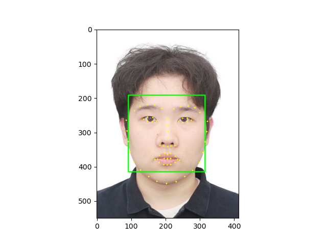
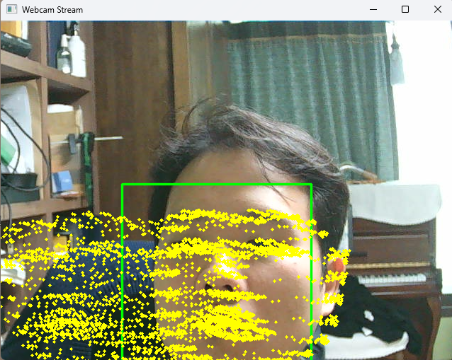
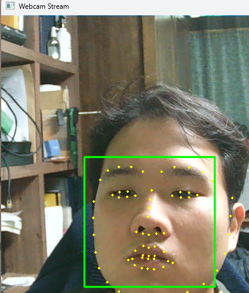
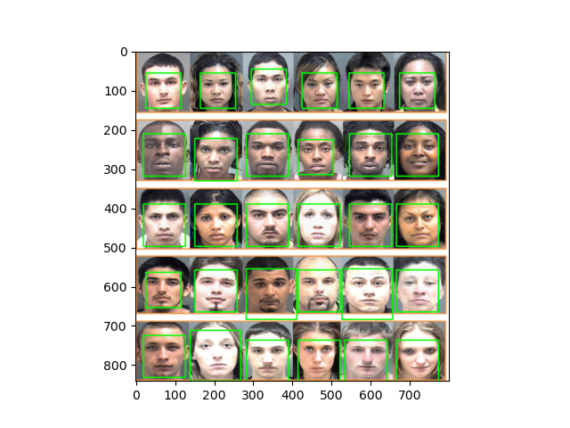
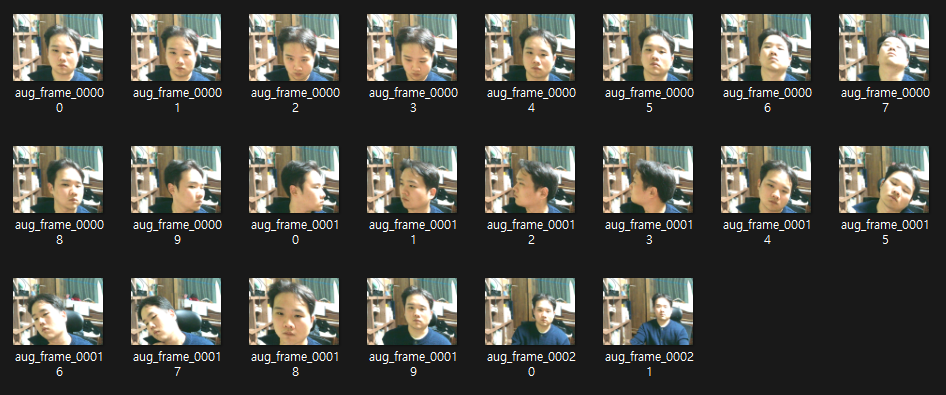
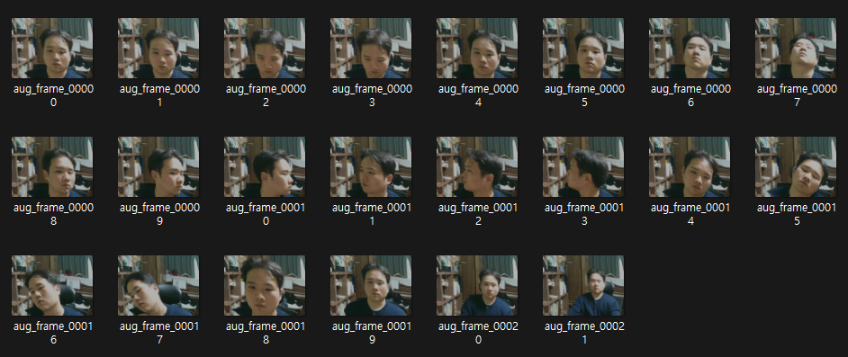
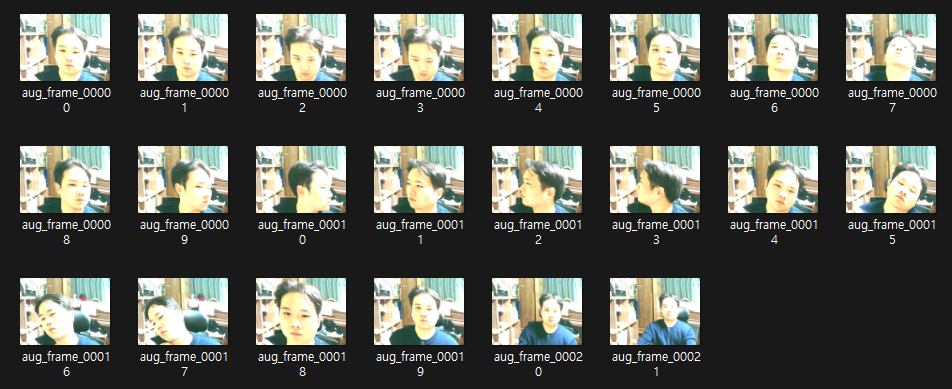
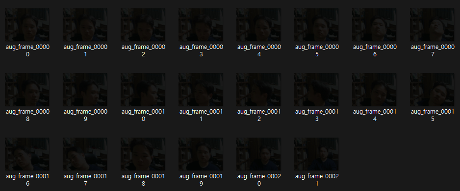
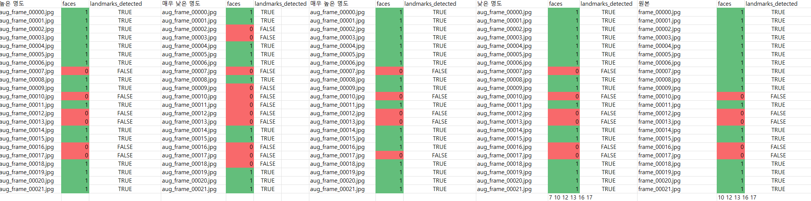
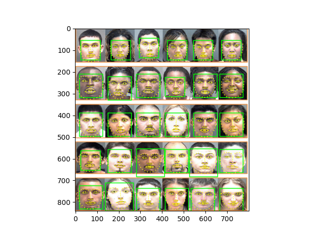

# Face detection

face landmark는 detection 의 결과물인 bounding box 로 잘라낸(crop) 얼굴 이미지



- 코드 수정
    
    약간의 코드 변경을 통해 웹캠으로 실시간 바운딩박스 추적이 가능하다.
    
    바운딩 박스의 좌표를 return 받으면 정면 얼굴 인식에 대한 정량적인 평가가 가능하지 않을까? 하는 생각이 든다. 단, 웹캠을 사용하지 않고 있어야한다.
    
    EX) ZEP에서 키고 돌리면 안켜진다.
    
    `list_landmarks = []` 가 `while` 밖에 있으면 점이 누적되어 그려진다.
    
    ```python
    import cv2
    import dlib
    
    cap = cv2.VideoCapture(0)
    detector_hog = dlib.get_frontal_face_detector()
    model_path = 'models/shape_predictor_68_face_landmarks.dat'
    landmark_predictor = dlib.shape_predictor(model_path)
    
    if not cap.isOpened():
        print("웹캠을 열 수 없습니다.")
        exit()
    
    while True:
        ret, frame = cap.read()
        if not ret:
            print("프레임을 읽을 수 없습니다.")
            break
    
        img_rgb = cv2.cvtColor(frame, cv2.COLOR_BGR2RGB)
        dlib_rects = detector_hog(img_rgb, 1)
    
        list_landmarks = []  #  매 프레임마다 초기화
    
        for dlib_rect in dlib_rects:
            cv2.rectangle(img_rgb, (dlib_rect.left(), dlib_rect.top()),
                          (dlib_rect.right(), dlib_rect.bottom()), (0, 255, 0), 2, lineType=cv2.LINE_AA)
    
            points = landmark_predictor(img_rgb, dlib_rect)
            list_points = [(p.x, p.y) for p in points.parts()]
            list_landmarks.append(list_points)
    
        img_show_rgb = cv2.cvtColor(img_rgb, cv2.COLOR_BGR2RGB)
    
        for landmark in list_landmarks:
            for point in landmark:
                cv2.circle(img_show_rgb, point, 2, (0, 255, 255), -1)
    
        cv2.imshow('Webcam Stream', img_show_rgb)
    
        if cv2.waitKey(1) & 0xFF == ord('q'):
            break
    
    cap.release()
    cv2.destroyAllWindows()
    
    ```
    
    `list_landmarks = []` 를 루프 안에 넣었을 경우 매 회차마다 초기화 되어 스티커가 지워진다.
    
    
    
    
    

1. 여러가지의 조건에서의 실험

1. 정면 얼굴은 어디부터 어디까지로 정의하는가?




보통 턱부터 눈썹 위까지 임을 알 수 있다.

매끄러운 실험을 위해 3가지 코드를 짯다.

1. 버튼을 누르면 사진을 저장하는 코드
2. 저장한 사진을 기울이고 명도를 조절하는 코드
3. 증강된 사진, 원본 사진의 탐지된 객체갯수,  랜드마크탐지여부 boolean 값을 csv 반환하는 코드 

- 3가지의 코드
    
    ```python
    import cv2
    import os
    
    save_dir = 'captured_frames'
    os.makedirs(save_dir, exist_ok=True)
    
    cap = cv2.VideoCapture(0)
    if not cap.isOpened():
        print("웹캠을 열 수 없습니다.")
        exit()
    
    frame_count = 0
    
    print("화면에서 'c'를 누르면 캡처, 'q'를 누르면 종료")
    
    while True:
        ret, frame = cap.read()
        if not ret:
            print("프레임을 읽을 수 없습니다.")
            break
    
        cv2.imshow('Webcam', frame)
    
        key = cv2.waitKey(1) & 0xFF
    
        # 'c' 키 누르면 저장
        if key == ord('c'):
            filename = os.path.join(save_dir, f'frame_{frame_count:05d}.jpg')
            cv2.imwrite(filename, frame)
            print(f"{filename} 저장 완료")
            frame_count += 1
    
        # 'q' 키 누르면 종료
        elif key == ord('q'):
            break
    
    cap.release()
    cv2.destroyAllWindows()
    
    ```
    
    ```python
    # 찍은 사진에 증강을 주는 코드
    
    import cv2
    import os
    import glob
    import numpy as np
    
    src_dir = 'captured_frames'
    dst_dir = 'augmented_fixed'
    os.makedirs(dst_dir, exist_ok=True)
    
    def adjust_brightness(img, alpha=0.7):
        """밝기 조절 (alpha>1 밝게, <1 어둡게)"""
        return cv2.convertScaleAbs(img, alpha=alpha, beta=0)
    
    def affine_transform(img, rot_deg=10, shear_deg=8):
        """회전(rot_deg도), 기울이기(shear_deg도)"""
        h, w = img.shape[:2]
        center = (w // 2, h // 2)
    
        # 회전 행렬
        M_rot = cv2.getRotationMatrix2D(center, rot_deg, 1.0)
    
        # shear 행렬
        shear = np.tan(np.deg2rad(shear_deg))
        M_shear = np.array([[1, shear, -shear * center[1]],
                            [0, 1, 0]], dtype=np.float32)
    
        rotated = cv2.warpAffine(
            img, M_rot, (w, h), flags=cv2.INTER_LINEAR, borderMode=cv2.BORDER_REFLECT101)
        skewed = cv2.warpAffine(rotated, M_shear, (w, h),
                                flags=cv2.INTER_LINEAR, borderMode=cv2.BORDER_REFLECT101)
        return skewed
    
    for path in glob.glob(os.path.join(src_dir, '*.jpg')):
        img = cv2.imread(path)
        if img is None:
            continue
    
        # 밝기 + 회전/기울이기 고정값 적용
        img_aug = adjust_brightness(img, alpha=0.1)  # 밝기 1.3배
        img_aug = affine_transform(img_aug, rot_deg=-10, shear_deg=8)
    
        name = os.path.basename(path)
        save_path = os.path.join(dst_dir, f"aug_{name}")
        cv2.imwrite(save_path, img_aug)
        print(f"{save_path} 저장 완료")
    
    print("고정값 증강 완료")
    
    ```
    
    ```python
    # 증강된 사진, 원본 사진의 탐지된 객체갯수, 탐지여부 boolean 값 반환
    import cv2
    import dlib
    import glob
    import os
    import csv
    
    # 경로 설정
    img_dir = 'captured_frames/extra_low'
    model_path = r'models/shape_predictor_68_face_landmarks.dat'
    csv_path = 'detection_result_extra_low.csv'
    
    # 모델 로드
    detector = dlib.get_frontal_face_detector()
    predictor = dlib.shape_predictor(model_path)
    
    # 이미지 목록
    img_paths = glob.glob(os.path.join(img_dir, '*.*'))
    
    # CSV 헤더 작성
    with open(csv_path, 'w', newline='', encoding='utf-8') as f:
        writer = csv.writer(f)
        writer.writerow(['filename', 'faces', 'landmarks_detected'])
    
        for path in img_paths:
            img = cv2.imread(path)
            if img is None:
                print(f"[X] 파일 읽기 실패: {path}")
                continue
    
            img_rgb = cv2.cvtColor(img, cv2.COLOR_BGR2RGB)
            rects = detector(img_rgb, 1)
            face_count = len(rects)
            landmarks_detected = False
    
            if face_count > 0:
                for rect in rects:
                    try:
                        predictor(img_rgb, rect)
                        landmarks_detected = True
                        break  # 하나만 감지되어도 True로 처리
                    except:
                        landmarks_detected = False
    
            filename = os.path.basename(path)
            writer.writerow([filename, face_count, landmarks_detected])
            print(f"{filename} -> 얼굴: {face_count}개, 랜드마크 감지: {landmarks_detected}")
    
    print(f"\n결과 저장 완료: {csv_path}")
    
    ```
    

***case1.) origin set에서 실패한 경우***


10 12 13 16 17

***명도를 높히고 기울인 set에서 실패한 경우***



7 10 12 13 16 17

***명도를 내리고 기울인 set에서 실패한 경우***



7 10 12 13 16 17

***명도를 매우 높히고 기울인 set에서 실패한 경우***



7 10 12 13 17

***명도를 매우 낮추고 기울인 set에서 실패한 경우***



2 3 7 9 10 11 12 13 14  16 17



[Data.csv](Data.csv)

| 원본 | 10 12 13 16 17 |
| --- | --- |
| 낮은 명도 | 7 10 12 13 16 17 |
| 높은 명도 | 7 10 12 13 16 17 |
| 매우 낮은 명도 | 2 3 7 9 10 11 12 13 14  16 17 |
| 매우 높은 명도 | 7 10 12 13 17 |

5가지의 case에서 모두 실패한 경우

10, 12, 13, 17

대부분의 경우 옆 모습, 고개를 뒤로 젖힌 경우 모델이 탐지를 못했음을 알 수 있었다.

단 명도가 높아진 경우보다 낮아진 경우 모델이 탐지를 못하는 경우가 늘었다.

거리가 늘어난 경우는 명도 변화에도 탐지에는 문제가 없었다.

준비한 사진이 충분히 작지 않아서 그럴 수 있는 경우에 대비해서 인터넷에서 사진을 받아와 추가적으로 실험했다.



거리가 늘어나면 얼굴의 픽셀이 작아지기 때문에 작은 얼굴이 많은 사진으로 준비했다.

거리가 늘어난 경우에도 탐지에는 문제가 없었다.

| 조건 | 검출 실패 원인 | 영향 정도 |
| --- | --- | --- |
| 옆모습 / 고개 뒤로 | 얼굴 정면 특징 손실 (눈, 코, 턱 비대칭) | 매우 큼 |
| 명도 낮음 | 경계 방향 손실 | 큼 |
| 명도 높음 | 경계 방향 일부 유지 | 보통 |
| 거리 증가 | 없음 | 작음 |