# Ablation Study

### 모델 구현

### PlainNet-34 / EPOCH = 40 / batch_size =32

Total training time: 2571.51 seconds

Best Train Accuracy: 99.43%
Best Validation Accuracy: 90.62%
Final Train Accuracy: 99.43%
Final Validation Accuracy: 90.62%

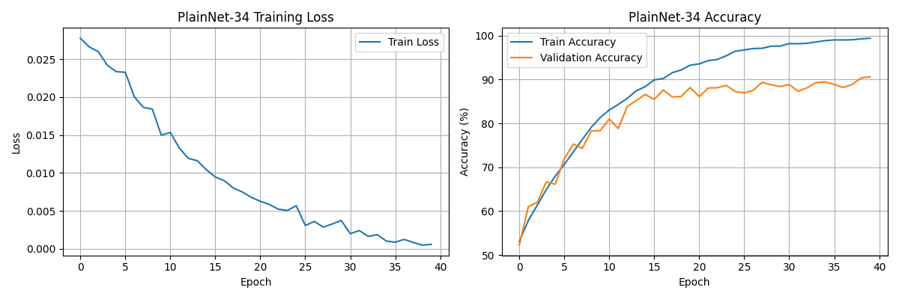

### ResNet -34 / EPOCH = 40 / batch_size =32

Training Summary:

Total training time: 2565.78 seconds
Best Train Accuracy: 99.82%
Best Validation Accuracy: 87.24%
Final Train Accuracy: 99.71%
Final Validation Accuracy: 82.92%

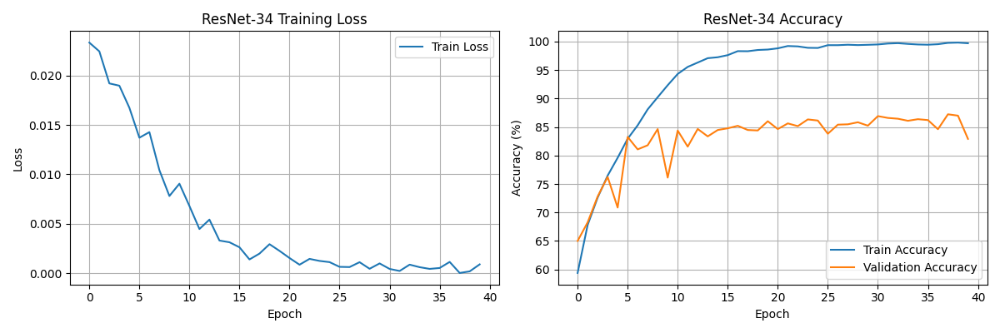

### Ablation Study Results

PlainNet-34 Best Val Acc: 90.62%
ResNet-34 Best Val Acc: 87.24%

Improvement with Skip Connection: -3.38%

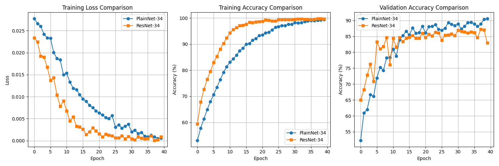

### 수렴속도는 빠름을 확인. 하지만 왜 성능이 더 낮은가?

- **ResNet-34:**
  - 최적화가 잘 돼서 train을 거의 다 외워버림.
  - 데이터셋이 작고 regularization이 약해서
    → val에는 과하게 맞춰지면서 오히려 점점 떨어지는 구간에 진입.
  - **과적합 시그널**

**ResNet-34** : Epoch 38: Validation Accuracy: 87.24%

**PlainNet-3**4 :Epoch 40: Validation Accuracy: 90.62%

다만, 깊은 신경망에서 skip-connection의 유무가 수렴이 더 빠름은 알 수 있음.

깊은 신경망에서 skip-connection의 유무가 수렴 속도를 극적으로 좌우.

ResNet 논문도 “optimization 관점”과 “generalization 관점”을 분리

### PlainNet-50 / EPOCH = 40 / batch_size =32

Training Summary:

Best Train Accuracy: 90.21%
Best Validation Accuracy: 80.12%
Final Train Accuracy: 90.21%
Final Validation Accuracy: 80.00%

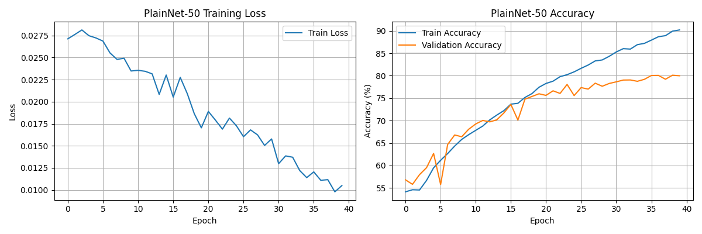

### ResNet -50 / EPOCH = 40 / batch_size =32

Training Summary:

Best Train Accuracy: 98.51%
Best Validation Accuracy: 84.62%
Final Train Accuracy: 98.51%
Final Validation Accuracy: 83.58%

### Ablation Study Results

PlainNet-34 Best Val Acc: 80.12%
ResNet-34 Best Val Acc: 84.62%
Improvement with Skip Connection: 4.50%

### ResNet-50

- Best Train Acc: **98.51%**
- Best Val Acc: **84.62%**
- Final Train Acc: **98.51%**
- Final Val Acc: **83.58%**

→ 40 epoch 기준에서

- 학습은 거의 다 맞춘 상태 (98.5%)
- val acc도 84%대까지 올라감
- 약간의 과적합은 있지만, 전체적으로 **잘 최적화된 모델**.

---

### PlainNet-50

- Best Train Acc: **90.21%**
- Best Val Acc: **80.12%**
- Final Train Acc: **90.21%**
- Final Val Acc: **80.00%**

→ 40 epoch 기준에서

- Train Acc가 **90%대** → 데이터를 **완전히 못 외움 (underfitting)**
- Val도 80% 근처에서 더 안 올라감
- 즉, **학습 자체가 잘 안 되는 상태 (최적화 실패에 가까움)**.

**깊이가 늘어나면서 plain이 최적화 자체가 무너진 전형적인 degradation** 패턴.

깊이가 증가할수록 plain network는 train error 자체가 더 나빠지는 **degradation problem**을 겪고,

residual connection이 있는 network는 같은 depth에서도 train error를 낮게 유지하며 학습이 잘 된다

### Comparison of Ablation Study Results

PlainNet-34 : 90.62%
ResNet-34 : 87.24%
PlainNet-50 : 80.12%
ResNet-50 : 84.62%

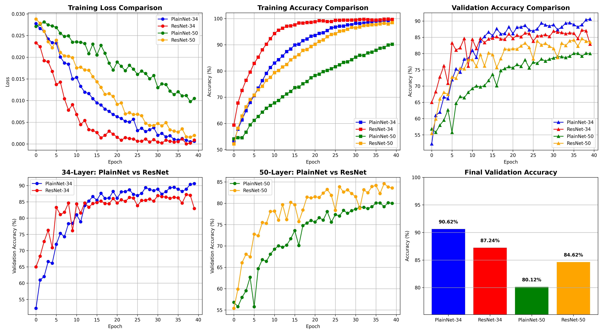

### Epoch 40 기준 Validation Accuracy

| Depth | Model Type  | Skip-Connection | Epoch | Validation Acc (%) |
| ----- | ----------- | --------------- | ----- | ------------------ |
| 34    | ResNet-34   | O               | 40    | **82.92**          |
| 34    | PlainNet-34 | X               | 40    | **90.62**          |
| 50    | ResNet-50   | O               | 40    | **83.58**          |
| 50    | PlainNet-50 | X               | 40    | **80.00**          |

### Epoch 40 기준 Best Validation Accuracy

| Depth | Model Type  | Skip-Connection | Best Epoch | Best Val Acc (%) |
| ----- | ----------- | --------------- | ---------- | ---------------- |
| 34    | ResNet-34   | O               | 38         | **87.24**        |
| 34    | PlainNet-34 | X               | 40         | **90.62**        |
| 50    | ResNet-50   | O               | ≤ 40       | **84.62**        |
| 50    | PlainNet-50 | X               | ≤ 40       | **80.12**        |

### 시각화

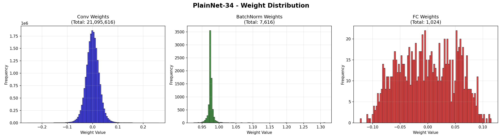

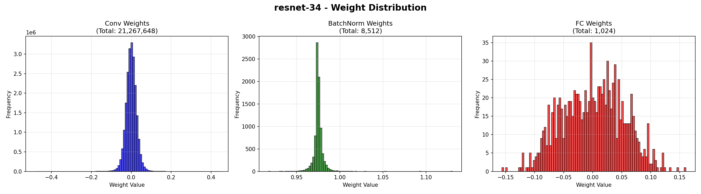

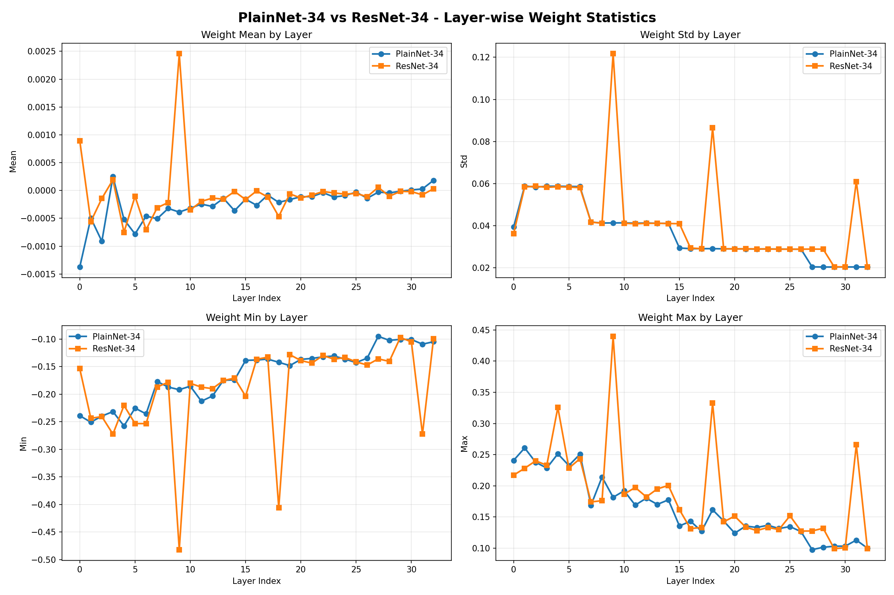

---

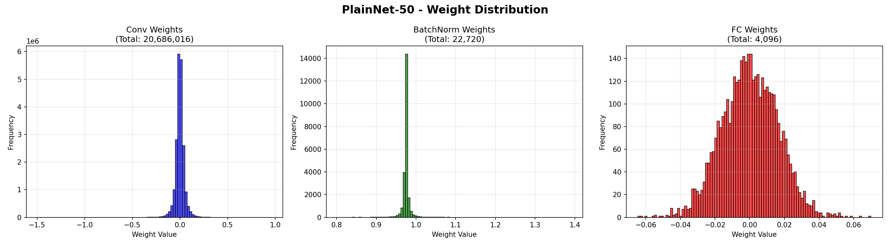

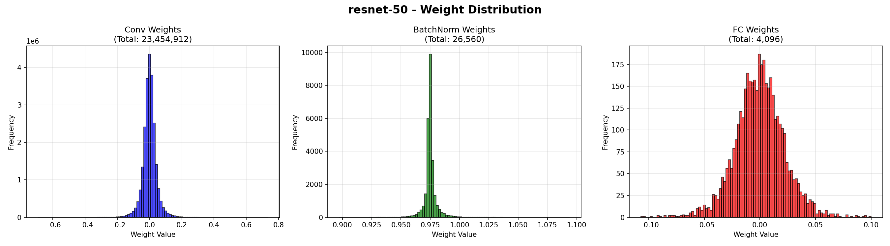

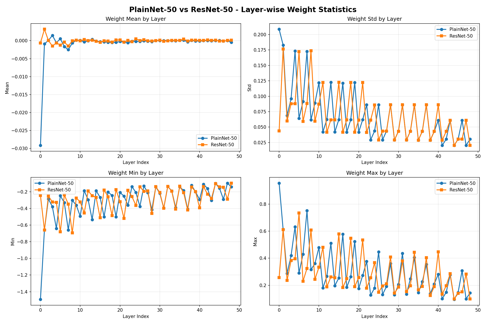

Weight가 왜 유의미한 차이가 없는지?

ResNet은 깊은 네트워크의 학습 과정에서 발생하는 최적화 문제(Degradation)를 해결하기 위해, skip connection을 활용한 잔차(residual) 구조를 적용한 모델.

논문의 실험(4.1절)에서도 34층 일반 망(Plain Net)에 BN(배치 정규화)을 적용한 것만으로도, 기울기가 소실되지 않고 정상적인 크기(healthy norms)를 보인 것을 확인했습니다. 저자들은 '기울기 소실'이 'Degradation'의 직접적인 원인이 아니라고 진단했습니다.

다만, 이는 34층 수준에서 BN이 기울기 소실을 완화한 것이지, 구조적으로 해결한 것은 아닙니다. 계층이 100, 150층 이상으로 극도로 깊어지면, BN만으로는 체인룰(Chain Rule)에 의한 연쇄 곱셈이라는 구조적 한계를 극복하지 못하고 기울기 소실이 다시 근본적인 문제로 대두됩니다.

---

### Unseem data에 대한 error rate

**The Oxford-IIIT Pet Dataset에서 Confusion Matrix로 성능 평가**

### Error rate results

| Model       | Error Rate (%) | Accuracy (%) | Dog Acc (%) | Cat Acc (%) |
| ----------- | -------------- | ------------ | ----------- | ----------- |
| PlainNet-34 | 14.17          | 85.82        | 78.19       | 89.46       |
| ResNet-34   | 24.55          | 75.44        | 85.46       | 70.67       |
| PlainNet-50 | 24.28          | 75.71        | 67.37       | 79.68       |
| ResNet-50   | 22.32          | 77.67        | 76.07       | 78.43       |

### Oxford-IIIT Pet, Cat/Dog Binary

| Depth | Arch   | Residual | Acc (%)   | Error (%) | Dog Acc (%) | Cat Acc (%) |
| ----- | ------ | -------- | --------- | --------- | ----------- | ----------- |
| 34    | Plain  | X        | **85.83** | **14.17** | 78.19       | **89.46**   |
| 34    | ResNet | O        | 75.44     | 24.56     | **85.46**   | 70.68       |
| 50    | Plain  | X        | 75.72     | 24.28     | 67.37       | 79.69       |
| 50    | ResNet | O        | 77.68     | 22.32     | 76.08       | 78.44       |

### Factor Ablation – Residual 유무 효과 (동일 depth 내 비교)

Depth 34에서: Plain → ResNet

| Metric  | Plain-34 | ResNet-34 | Δ(Res − Plain) |
| ------- | -------- | --------- | -------------- |
| Acc     | 85.83    | 75.44     | **−10.39**     |
| Error   | 14.17    | 24.56     | +10.39         |
| Dog Acc | 78.19    | 85.46     | +7.27          |
| Cat Acc | 89.46    | 70.68     | −18.78         |

→ 34층에서는 residual 추가가

- Dog 쪽은 ↑, Cat 쪽은 크게 ↓, 전체 Acc는 **크게 악화**.

### Depth 50에서: Plain → ResNet

| Metric  | Plain-50 | ResNet-50 | Δ(Res − Plain) |
| ------- | -------- | --------- | -------------- |
| Acc     | 75.72    | 77.68     | **+1.96**      |
| Error   | 24.28    | 22.32     | −1.96          |
| Dog Acc | 67.37    | 76.08     | +8.71          |
| Cat Acc | 79.69    | 78.44     | −1.25          |

→ 50층에서는 residual 추가가

- 전체 Acc를 **소폭 개선**, Dog 성능 크게 ↑, Cat은 거의 유지.

### Factor Ablation – “Depth” 효과 (동일 구조 내 34 → 50)

| Metric  | Plain-34 | Plain-50 | Δ(50 − 34) |
| ------- | -------- | -------- | ---------- |
| Acc     | 85.83    | 75.72    | **−10.11** |
| Error   | 14.17    | 24.28    | +10.11     |
| Dog Acc | 78.19    | 67.37    | −10.82     |
| Cat Acc | 89.46    | 79.69    | −9.77      |

→ Plain에서는 깊이를 34 → 50으로 늘리면 **전반적으로 성능이 크게 악화**.

### ResNet: 34 → 50

| Metric  | ResNet-34 | ResNet-50 | Δ(50 − 34) |
| ------- | --------- | --------- | ---------- |
| Acc     | 75.44     | 77.68     | **+2.24**  |
| Error   | 24.56     | 22.32     | −2.24      |
| Dog Acc | 85.46     | 76.08     | −9.38      |
| Cat Acc | 70.68     | 78.44     | +7.76      |

→ ResNet에서는 깊이를 늘리면

- 전체 Acc는 **소폭 증가**,
- class-wise trade-off(Dog ↓, Cat ↑)가 발생.

### 알게된 사실

### PlainNet-34는 Cat을 잘 맞춘다

- Cat Acc: **89.46%**
- Dog Acc: 78%

### ResNet-34는 Dog을 잘 맞춘다

- Dog Acc: **85.46%**
- Cat Acc: 70%

1. **skip connection이 무조건 좋은 건 아니다.**

2. **다만, 깊이가 커지면 ResNet이 최적화/feature diversity에서 이점을 가진다.**
