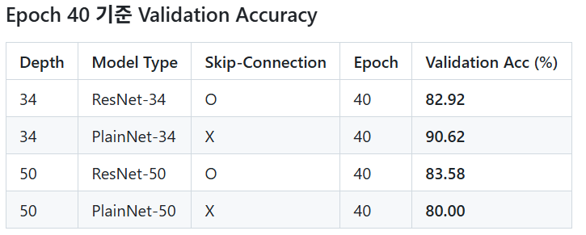
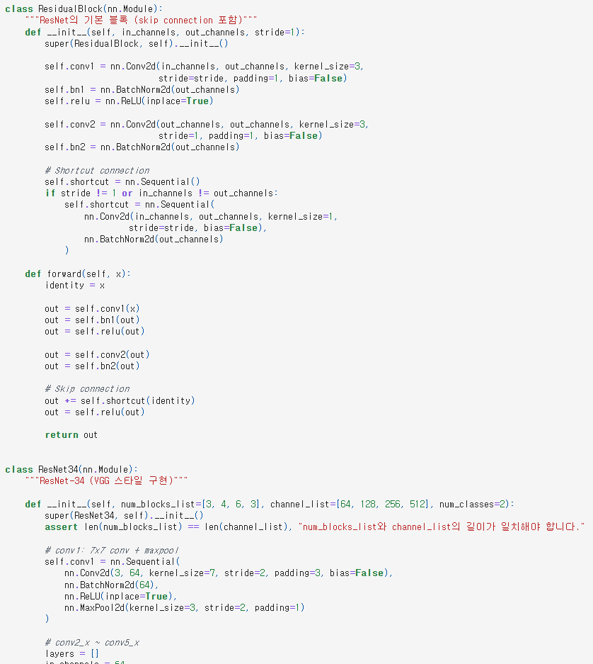
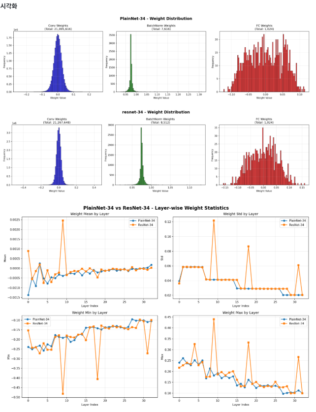
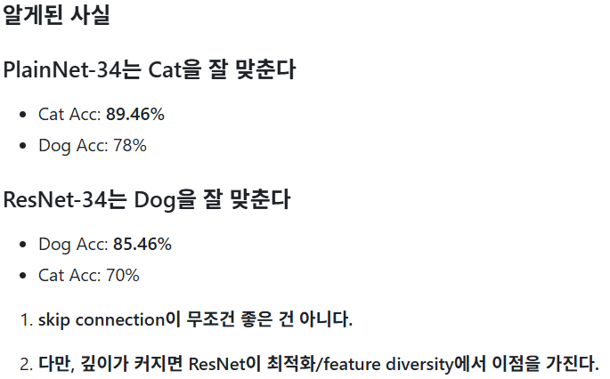
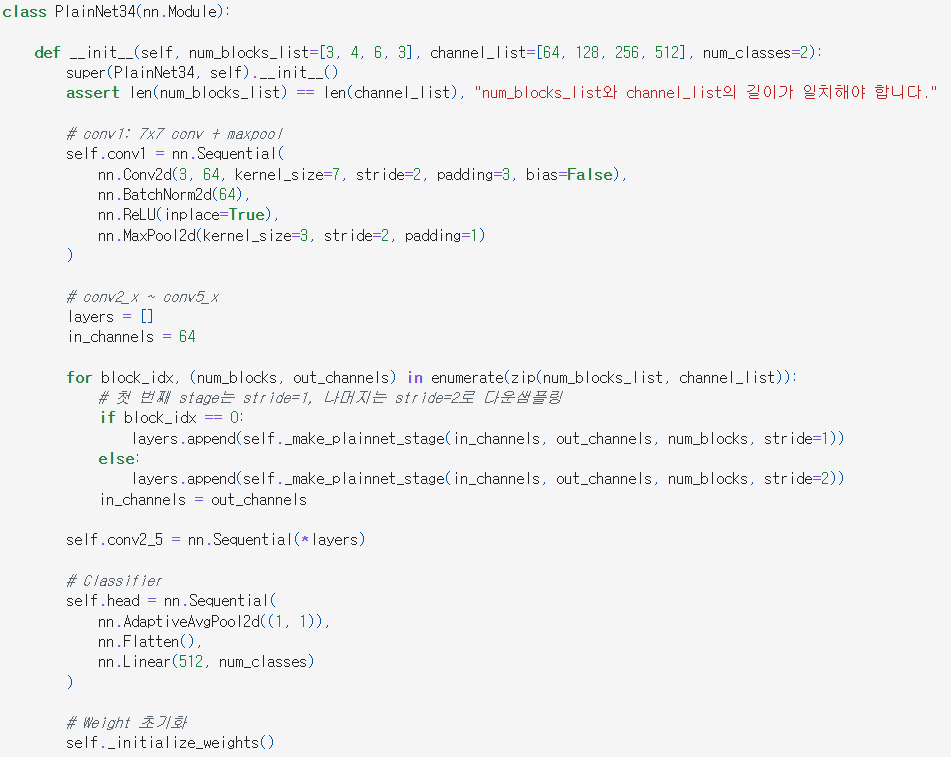
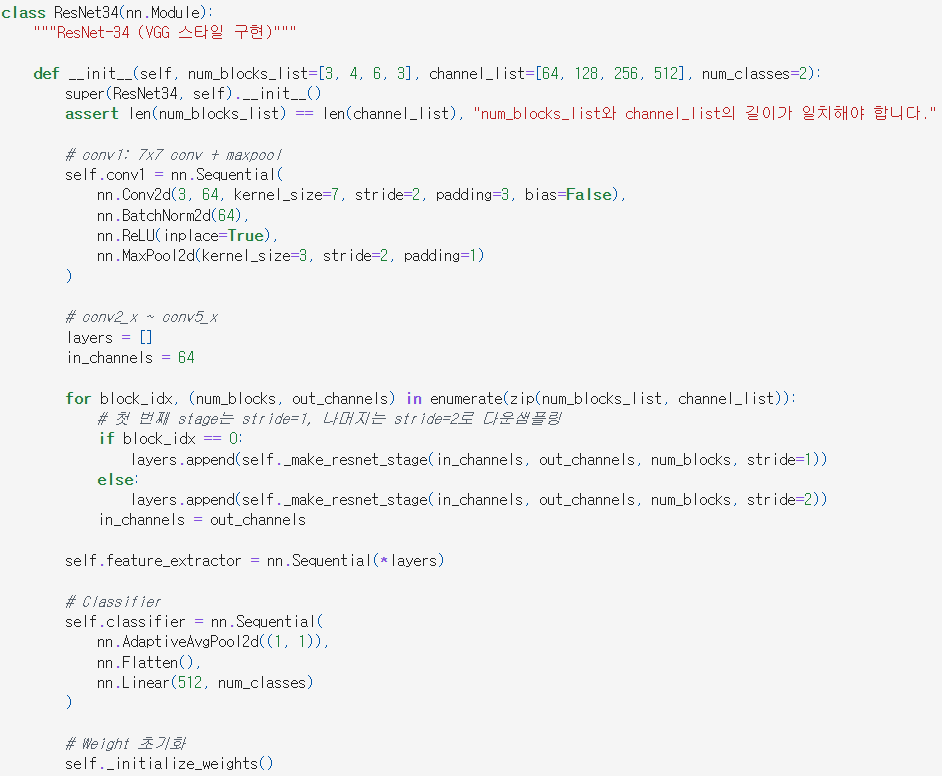

# AIFFEL Campus Online Code Peer Review Templete
- 코더 : 임보혁
- 리뷰어 : 최재훈


# PRT(Peer Review Template)
- [x]  **1. 주어진 문제를 해결하는 완성된 코드가 제출되었나요?**
    - 문제에서 요구하는 residual connection의 유무에 따른 성능을 잘 비교하였다.
    
    
- [x]  **2. 전체 코드에서 가장 핵심적이거나 가장 복잡하고 이해하기 어려운 부분에 작성된 
주석 또는 doc string을 보고 해당 코드가 잘 이해되었나요?**
    - 이번 프로젝트는 Residual Block의 유무에 따른 모델 성능을 비교하는 과정이기 때문에 해당 함수를 정의하는 블럭이 가장 핵심이 되었던것 같다.
    
        
- [x]  **3. 에러가 난 부분을 디버깅하여 문제를 해결한 기록을 남겼거나
새로운 시도 또는 추가 실험을 수행해봤나요?**
    - 가중치 상태에 대한 그래프도 추가로 비교하여 평균, 최소, 최대를 비교하였다.
    
        
- [x]  **4. 회고를 잘 작성했나요?**
    - 결과에 대해 잘 정리를 하였다.
    - 특히 모델별 Training accuracy, Loss를 그래프로 잘 정리하였고 ablation study를 진행한 결과도 잘 기록하여 비교하였다.
    - 가중치에 대한 시각화도 하여 모델별 학습 상태를 확인하였고 모델별 어떤 성능이 우수한지 비교하였다.
    
        
- [x]  **5. 코드가 간결하고 효율적인가요?**
    - 각 모델별로 클래스를 구분하여 필요한 함수들을 모듈화 하여 잘 구성하였다.
    - 만들어둔 모듈화 함수/클래스들을 필요한 부분에 잘 사용하였다.
     | 


# 회고(참고 링크 및 코드 개선)
```
프로젝트를 진행하면서 단순 모델의 성능만 비교하고 끝나는 것이 아닌 가중치 상태를 비교까지 진행한 부분이 좋았던것 같다.
또한, 실험 결과에 대해 다양한 수치에 대해 비교하는 시각화 그래프를 보여줘 이해하는데 편했고 비교하는데도 수월했다.
```
