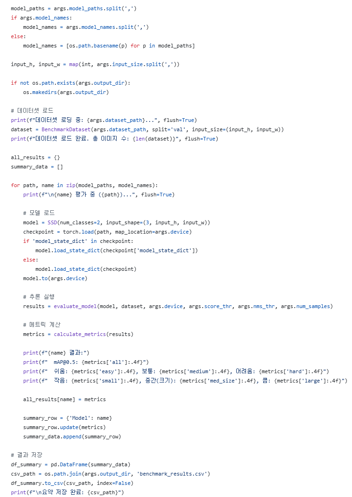
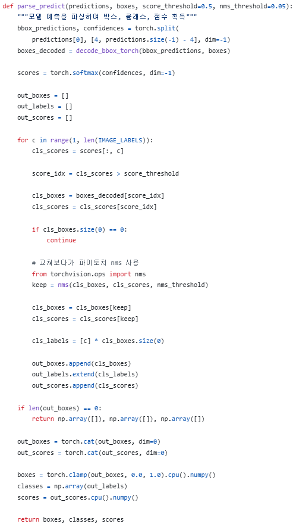
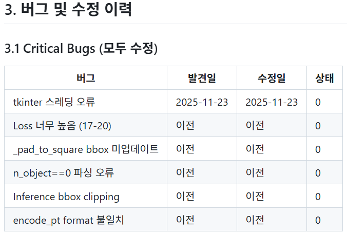
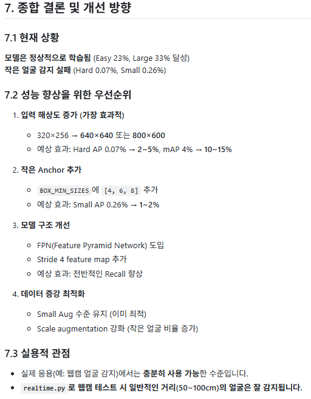
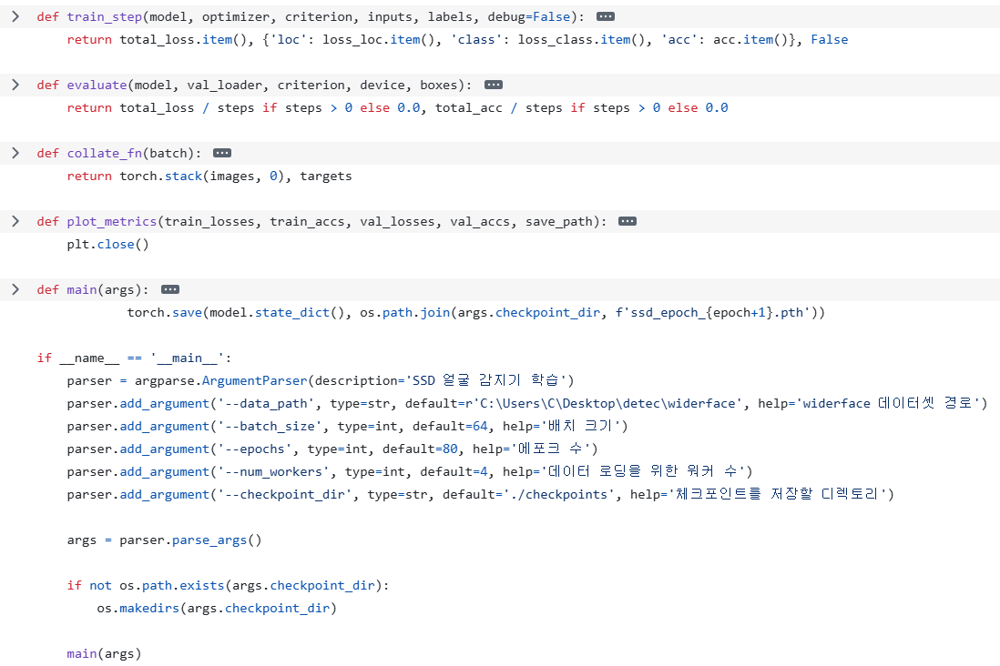

# AIFFEL Campus Online Code Peer Review Templete
- 코더 : 임보혁
- 리뷰어 : 최재훈


# PRT(Peer Review Template)
- [x]  **1. 주어진 문제를 해결하는 완성된 코드가 제출되었나요?**
    - 주언진 문제를 해결하기 위해 모델을 만들어 불러오고 추론을 실행해 결과를 저장하는 코드가 잘 구성되어 있다.

    
    
- [x]  **2. 전체 코드에서 가장 핵심적이거나 가장 복잡하고 이해하기 어려운 부분에 작성된 주석 또는 doc string을 보고 해당 코드가 잘 이해되었나요?**
    - 전체적으로 코드마다 주석이 달려있어 코드를 이해하는데 매우 도움이 되었다. 
        
    

- [x]  **3. 에러가 난 부분을 디버깅하여 문제를 해결한 기록을 남겼거나 새로운 시도 또는 추가 실험을 수행해봤나요?**
    - 버그가 발생한 부분을 표로 순차적으로 정리하여 해결하였다.
        
    

- [x]  **4. 회고를 잘 작성했나요?**
    - 종합 결론을 내었고 결과에 대한 평가도 들어있다. 성능 향상을 위한 우선 순위도 넣어 다양한 실험의 결과를 확인할 수 있다.
        
    

- [x]  **5. 코드가 간결하고 효율적인가요?**
    - 전체적으로 함수들이 모듈화가 잘 되어있어 보기 편하고 파일도 나눠놔서 task 별로 보기 편했다.

    

# 회고(참고 링크 및 코드 개선)
```
보통 퀘스트를 진행할때 하나의 노트북 파일에서 모든 코드를 실행하는 방법으로 진행을 헀는데 이번 코드를 보고 여러 파일에서 코드를 넣어두고 진행하는 것이 매우 인상깊었다. 훨씬 보기 쉽고 수정하기도 편해보인다.
또한 결과도 잘 구분해서 정리해둬서 결과 확인하는데도 매우 수월했다.
```
