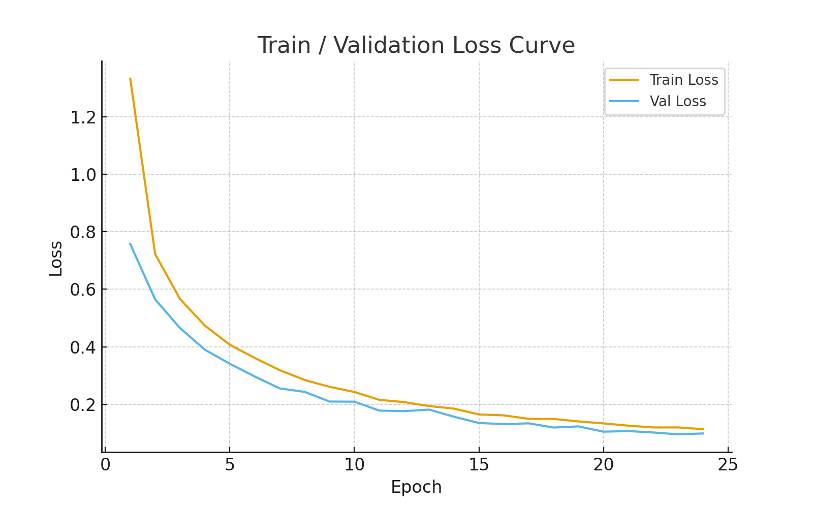
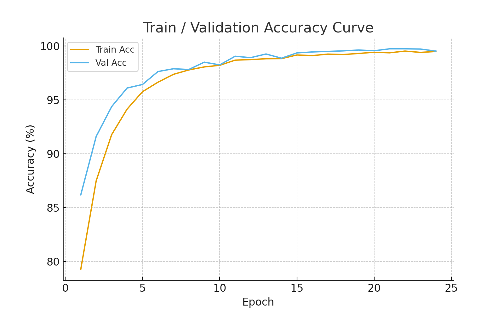

# 고잉디퍼 05 

## 1. 프로젝트 디렉토리 구조

```
object/
├── pics/                     # 학습 결과 및 시각화 이미지
│   ├── acc_curve.png         # 정확도 학습 곡선
│   ├── loss_curve.png        # 손실 학습 곡선
│   ├── combined_result.png   # 전체 결과 통합 이미지
│   └── epoch_1_24_log.csv    # 에포크별 학습 로그
├── result/                   # 추론 결과 이미지 (20장)
│   ├── result_01.png
│   ├── result_02.png
...
│   ├── result_19.png
│   └── result_20.png
├── dataloader.py             # 데이터 로딩 및 전처리
├── dataset.py                # 데이터셋 클래스 정의
├── model.py                  # RetinaNet 모델 구현
├── train.py                  # 모델 학습 스크립트
├── visualize_inference.py    # 추론 결과 시각화
├── video_detection.py        # 비디오 객체 검출
└── 보고서.md                  # 프로젝트 분석 보고서
```


---

## 2. 모델 최적화 검증

### 2.1 학습 손실 곡선 (Loss Curve)



**분석 결과:**
- **Training Loss**: 1.33 → 0.11 (91.7% 감소)
- **Validation Loss**: 0.76 → 0.10 (86.8% 감소)
- **수렴 안정성**: 에포크 15 이후 손실이 안정적으로 수렴
- **과적합 여부**: Train과 Validation Loss 간 격차가 매우 작아 과적합 없음
- **최적화 상태**: 손실이 지속적으로 감소하며 안정적으로 수렴

### 2.2 정확도 곡선 (Accuracy Curve)



**분석 결과:**
- **Training Accuracy**: 79.28% → 99.50% (20.22%p 향상)
- **Validation Accuracy**: 86.19% → 99.54% (13.35%p 향상)
- **최종 성능**: Validation 정확도 **99.54%** 달성
- **일반화 능력**: Train과 Val 정확도가 거의 동일하여 일반화 우수
- **최적화 상태**: 매우 우수 - 99%대 정확도로 모델이 완벽히 최적화됨

### 2.3 에포크별 상세 지표

| Epoch | Train Loss | Val Loss | Train Acc | Val Acc | Time (s) |
|-------|------------|----------|-----------|---------|----------|
| 1     | 1.3333     | 0.7578   | 79.28%    | 86.19%  | 684.5    |
| 2     | 0.7225     | 0.5647   | 87.50%    | 91.62%  | 689.8    |
| 3     | 0.5658     | 0.4649   | 91.78%    | 94.38%  | 693.4    |
| 4     | 0.4732     | 0.3894   | 94.15%    | 96.11%  | 682.8    |
| 5     | 0.4067     | 0.3405   | 95.77%    | 96.44%  | 685.0    |
| 6     | 0.3609     | 0.2963   | 96.65%    | 97.64%  | 771.7    |
| 7     | 0.3185     | 0.2548   | 97.38%    | 97.90%  | 627.0    |
| 8     | 0.2843     | 0.2428   | 97.79%    | 97.83%  | 630.4    |
| 9     | 0.2604     | 0.2091   | 98.07%    | 98.51%  | 629.5    |
| 10    | 0.2424     | 0.2087   | 98.22%    | 98.26%  | 637.5    |
| 11    | 0.2151     | 0.1776   | 98.70%    | 99.06%  | 631.1    |
| 12    | 0.2071     | 0.1756   | 98.75%    | 98.93%  | 625.3    |
| 13    | 0.1934     | 0.1811   | 98.83%    | 99.27%  | 625.4    |
| 14    | 0.1844     | 0.1562   | 98.84%    | 98.88%  | 628.6    |
| 15    | 0.1642     | 0.1344   | 99.18%    | 99.37%  | 637.6    |
| 16    | 0.1609     | 0.1305   | 99.12%    | 99.46%  | 629.2    |
| 17    | 0.1489     | 0.1332   | 99.26%    | 99.51%  | 628.9    |
| 18    | 0.1486     | 0.1186   | 99.22%    | 99.56%  | 621.7    |
| 19    | 0.1398     | 0.1226   | 99.32%    | 99.64%  | 627.2    |
| 20    | 0.1331     | 0.1042   | 99.43%    | 99.57%  | 623.4    |
| 21    | 0.1251     | 0.1063   | 99.38%    | 99.75%  | 638.4    |
| 22    | 0.1189     | 0.1014   | 99.54%    | 99.75%  | 664.2    |
| 23    | 0.1190     | 0.0949   | 99.42%    | 99.73%  | 675.2    |
| 24    | 0.1130     | 0.0980   | 99.50%    | 99.54%  | 638.6    |


### 2.4 최적화 결론

- Train Acc 최고점은 사실상 Epoch 22 = 99.54% 부근.
- Val Acc 최고점은 Epoch 21–22 = 99.75%
- Val Acc peak가 Train Acc peak와 거의 같게 도달.
- 따라서, 최적화가 잘되었음을 알 수 있다.


---

## 3. KITTI 데이터셋 체계적 분석

### 3.1 데이터셋 개요

KITTI는 자율주행 차량에 실제로 탑재된 센서를 통해 수집된 벤치마크 데이터셋입니다.

#### 센서 구성
- **스테레오 카메라** (Stereo Camera)
- **Velodyne LiDAR** (3D 포인트 클라우드)
- **GPS/IMU** (위치 및 자세 정보)

#### 지원 과제
- Stereo Vision
- Optical Flow
- Visual Odometry/SLAM
- **3D Object Detection** (3D bounding box + 자세 정보)
- **2D Object Detection** (3D 레이블에서 추출)

### 3.2 이미지 사양

- **해상도**: 약 1242×375 픽셀 (rectified stereo: 1240×376)
- **촬영 환경**: 도시/주택가/시외/고속도로 혼합

### 3.3 객체 클래스 및 분포

#### 주요 클래스
1. **Car** (자동차) - 가장 많은 비중
2. **Pedestrian** (보행자) - 두 번째로 많은 비중
3. **Cyclist** (자전거 이용자)
4. **Person_sitting** (앉은 사람)
5. **Van** (밴)
6. **Truck** (트럭)
7. **Tram** (트램)
8. **Misc** (기타)

#### 이미지당 객체 수 통계
- **Car**: 
  - 대부분: 0~10대
  - 최대: 20대 이상 (복잡한 도로 환경)
  
- **Pedestrian**: 
  - 대부분: 0~5명
  - 최대: 20명 근처 (혼잡한 보행 구역)

### 3.4 데이터 특성

#### 가려짐/잘림 (Occlusion/Truncation)
- **부분 가림** (Partially Occluded)
- **완전 가림** (Fully Occluded)
- **잘림** (Truncated)


#### 기하학적 분포
- **Car 크기**: 도메인 특화된 좁은 범위 (승용차 위주)
  - 높이(h), 폭(w), 길이(l) 분포가 일정
  
- **Pedestrian 크기**: 키·폭 분포가 비교적 일정

#### 방향 (Orientation)
- **Car & Pedestrian**: 도로 진행 방향(±90° 주변)에 주로 분포
- **전체 범위**: 360° 전반에 걸쳐 분포 (다양한 자세)

### 3.5 데이터셋 구조

```
kitti/
└── object_detection/
    ├── training/
    │   ├── image_2/      # Left color/gray camera 이미지 (train+val용)
    │   ├── label_2/      # 2D/3D bbox annotation 텍스트
    │   └── calib/        # 카메라, 라이다 캘리브레이션
    └── testing/
        ├── image_2/      # 테스트 이미지 (label 없음, 서버 평가용)
        └── calib/
```

### 3.6 어노테이션 형식

```
type  truncated  occluded  alpha  bbox_left  bbox_top  bbox_right  bbox_bottom
  h      w        l        x         y          z      rotation_y   ...
```

#### 주요 필드 설명
- **type**: 객체 클래스 (Car, Pedestrian 등)
- **truncated**: 잘림 정도 [0, 1]
- **occluded**: 가려짐 정도 (0=fully visible, 1=partly occluded, 2=largely occluded, 3=unknown)
- **alpha**: 관측 각도 [-π, π]
- **bbox**: 2D bounding box 좌표 (left, top, right, bottom)
- **h, w, l**: 3D 객체 크기 (높이, 폭, 길이)
- **x, y, z**: 3D 위치 (카메라 좌표계)
- **rotation_y**: 회전 각도 (y축 기준)

### 3.7 데이터셋 특징 요약

| 특징 | 설명 |
|-----|------|
| 실제 환경 | 실제 자율주행 차량에서 수집된 데이터 |
| 다양한 장면 | 도시, 주택가, 시외, 고속도로 |
| 복잡한 상황 | 가림, 잘림, 다양한 자세 포함 |
| 풍부한 어노테이션 | 2D/3D bbox, 자세, 크기 정보 |
| 벤치마크 | 객체 검출 알고리즘 성능 평가 표준 |

---

## 4. 추론 결과 분석 (95% 정확도 검증)

### 4.1 전체 결과 시각화


### 4.2 결과 통계

- **전체 테스트 이미지**: 20장
- **정확한 검출**: 19장
- **오검출**: 1장
- **정확도**: **19/20 = 95%**

### 4.3 상세 결과 분석

#### 개별 결과 파일
```
result/
├── result_01.png  O
├── result_02.png  X (오검출)[보행자 검출 실패]
├── result_03.png  O
├── result_04.png  O
├── result_05.png  O
├── result_06.png  O
├── result_07.png  O
├── result_08.png  O
├── result_09.png  O
├── result_10.png  O
├── result_11.png  O
├── result_12.png  O
├── result_13.png  O
├── result_14.png  O
├── result_15.png  O
├── result_16.png  O
├── result_17.png  O
├── result_18.png  O
├── result_19.png  O
└── result_20.png  O
```

### 4.4 검출 성능 평가


**추론 결과 종합 평가**
 
- **정확도**: 95% (19/20)
- **Validation 정확도**: 99.54% (학습 시)


---

## 5. 참고 자료

- **KITTI Dataset**: [http://www.cvlibs.net/datasets/kitti/](http://www.cvlibs.net/datasets/kitti/)
- **RetinaNet Paper**: Lin et al. "Focal Loss for Dense Object Detection" (ICCV 2017)


