# Text Recognition 데이터셋 구성 보고서

## 1. 데이터셋 구조 및 특징

### 1.1 프로젝트 구조

```
ocr/
├── dataloader.py          # 데이터셋 및 라벨 인코딩 구현
├── train.py              # CRNN 모델 및 학습 로직
├── inference.py          # 추론 및 평가
├── visualize.py          # 시각화 도구
├── stat.py              # 통계 분석
├── inference \
├ 추론된 사진들
├── dataset/             # LMDB 형식 데이터셋
└── checkpoints/         # 학습된 모델 저장
```

## 2. 이미지 리사이징 (Image Resizing)

```python
# 원본 이미지 크기
orig_w, orig_h = img_pil.size

# 높이를 32로 고정하고, 비율에 맞춰 너비 계산 (최대 100)
target_width = min(int(orig_w * self.img_size[1] / orig_h), self.img_size[0])
target_img_size = (target_width, self.img_size[1])

# 리사이징
img_pil = img_pil.resize(target_img_size)

# NumPy 배열로 변환 및 채널 순서 변경 (H,W,C) -> (C,H,W)
img = np.array(img_pil)
img = img.transpose(2, 0, 1)

# 제로 패딩으로 고정 크기 생성 (3, 32, 100)
padded_img = np.zeros((3, self.img_size[1], self.img_size[0]), dtype=np.float32)
c, h, w = img.shape
padded_img[:, :h, :w] = img
```

## 3. CTC Loss를 위한 라벨 인코딩

### 3.1 LabelConverter 클래스

CTC (Connectionist Temporal Classification) Loss는 시퀀스 정렬 문제를 해결하기 위해 **blank 토큰**을 사용합니다.

```python
class LabelConverter(object):
    def __init__(self, character):
        # CTC는 blank를 내부적으로 처리하므로 character에 blank를 포함하지 않음
        self.character = character
        self.label_map = dict()
        for i, char in enumerate(self.character):
            # blank=0이므로 실제 문자는 1부터 시작
            self.label_map[char] = i + 1

    def encode(self, text):
        # CTC는 반복 문자를 자동으로 처리하므로 blank 삽입 불필요
        encoded_label = []
        for char in text:
            encoded_label.append(self.label_map[char])
        return np.array(encoded_label, dtype=np.int32)

    def decode(self, encoded_label):
        decoded_label = ""
        for encode in encoded_label:
            if encode > 0:  # blank(0) 무시
                decoded_label += self.character[encode - 1]
        return decoded_label
```

### 3.2 인코딩 예시

```python
# 타겟 문자: "ABCDEFGHIJKLMNOPQRSTUVWXYZ0123456789"
# 인덱스 매핑:
# blank = 0
# 'A' = 1, 'B' = 2, ..., 'Z' = 26
# '0' = 27, '1' = 28, ..., '9' = 36
```

**예시: "HELLO" 인코딩**

| 문자   | H   | E   | L   | L   | O   |
| ------ | --- | --- | --- | --- | --- |
| 인덱스 | 8   | 5   | 12  | 12  | 15  |

### 3.3 CTC Loss 설정

#### 구현 코드 ([train.py](file:///c:/Users/C/Desktop/ocr/train.py#L187))

```python
# CTC Loss 초기화
criterion = nn.CTCLoss(
    blank=0,              # blank 토큰 인덱스
    reduction='mean',     # 배치 평균 손실
    zero_infinity=True    # 무한대 손실 방지
)
```

## 4. 배치 처리 (Batch Processing)

### 4.1 Collate Function

배치 처리를 위해 가변 길이 라벨을 패딩하고, 정규화를 수행합니다.

```python
def collate_fn(batch):
    imgs, encoded_labels, label_lens, raw_labels = zip(*batch)

    # 이미지를 [0,1] 범위로 정규화
    imgs_normalized = []
    for img in imgs:
        imgs_normalized.append(img / 255.0)

    imgs_tensor = torch.tensor(np.stack(imgs_normalized, axis=0), dtype=torch.float32)

    # 가변 길이 라벨을 최대 길이로 패딩
    max_len = max(label_lens)
    labels_padded = torch.zeros(len(batch), max_len, dtype=torch.long)
    for i, label_arr in enumerate(encoded_labels):
        length = label_lens[i]
        labels_padded[i, :length] = torch.tensor(label_arr, dtype=torch.long)

    batch_size = imgs_tensor.size(0)
    # 모델 출력 시퀀스 길이는 35 (7×5)
    input_length = torch.full(size=(batch_size,), fill_value=35, dtype=torch.long)
    label_length = torch.tensor(label_lens, dtype=torch.long)

    return (
        imgs_tensor,      # (B, 3, 32, 100)
        labels_padded,    # (B, max_len)
        input_length,     # (B,) - 모두 35
        label_length,     # (B,) - 실제 라벨 길이
        raw_labels,       # 디버깅용
    )
```

### 4.3 DataLoader 설정

```python
train_loader = DataLoader(
    train_dataset,
    batch_size=BATCH_SIZE,    # 128
    shuffle=True,             # 학습 시 셔플
    num_workers=4,            # 멀티프로세싱
    collate_fn=collate_fn,    # 커스텀 배치 처리
    drop_last=False           # 마지막 배치 유지
)

valid_loader = DataLoader(
    valid_dataset,
    batch_size=BATCH_SIZE,
    shuffle=True,
    num_workers=4,
    collate_fn=collate_fn,
    drop_last=False
)
```

### 4.4 배치 처리 특징

| 구성 요소       | 설정 값 | 목적                                 |
| --------------- | ------- | ------------------------------------ |
| **Batch Size**  | 128     | GPU 메모리 효율성과 학습 안정성 균형 |
| **Shuffle**     | True    | 학습 데이터 무작위화로 과적합 방지   |
| **Num Workers** | 4       | 병렬 데이터 로딩으로 I/O 병목 해소   |
| **Collate Fn**  | Custom  | 가변 길이 라벨 처리 및 정규화        |
| **Drop Last**   | False   | 모든 데이터 활용                     |

---

## 5. 학습 과정 및 모델 수렴 분석

### 5.1 학습 곡선

15 에포크 동안의 학습 과정에서 Train Loss와 Validation Loss의 변화를 추적했습니다.

| Epoch | Train Loss | Val Loss | Gap         |
| ----- | ---------- | -------- | ----------- |
| 1     | 0.4504     | 0.2162   | **–0.2342** |
| 2     | 0.1793     | 0.1797   | **+0.0004** |
| 3     | 0.1516     | 0.1504   | **–0.0012** |
| 4     | 0.1332     | 0.1447   | **+0.0115** |
| 5     | 0.1206     | 0.1373   | **+0.0167** |
| 6     | 0.1116     | 0.1257   | **+0.0141** |
| 7     | 0.1047     | 0.1198   | **+0.0151** |
| 8     | 0.0980     | 0.1128   | **+0.0148** |
| 9     | 0.0927     | 0.1119   | **+0.0192** |
| 10    | 0.0881     | 0.1121   | **+0.0240** |
| 11    | 0.0844     | 0.1093   | **+0.0249** |
| 12    | 0.0809     | 0.1085   | **+0.0276** |
| 13    | 0.0780     | 0.1084   | **+0.0304** |
| 14    | 0.0751     | 0.1163   | **+0.0412** |
| 15    | 0.0726     | 0.1124   | **+0.0398** |

### 5.2 학습 곡선

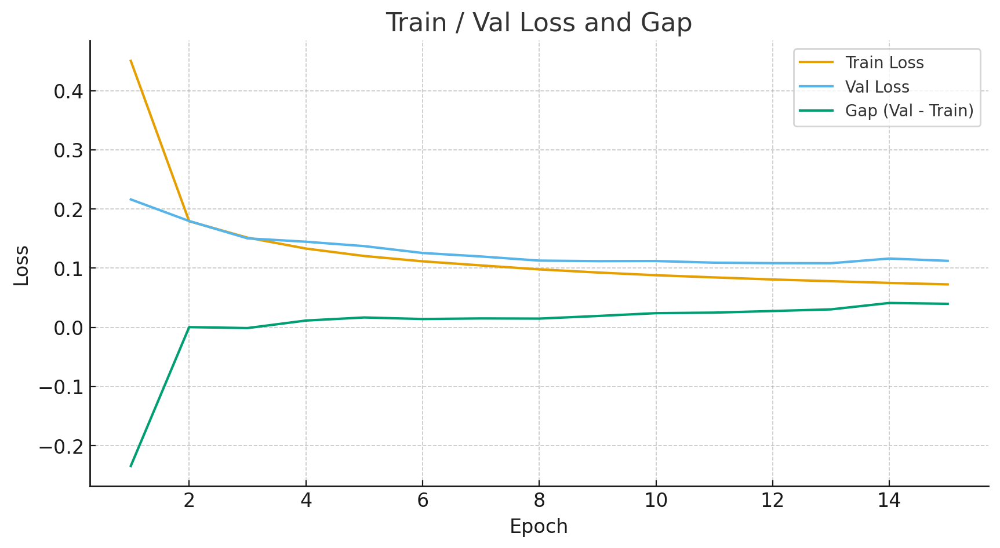

### 5. 최적 모델 선택

#### 최적 Epoch 분석

**Validation Loss 기준 최저점:**

- **Epoch 13: Val Loss = 0.1084**
- Epoch 12: Val Loss = 0.1085 (거의 동일)

**선택 기준:**
| 기준 | Epoch 11 | Epoch 12 | **Epoch 13** |
|------|----------|----------|--------------|
| Val Loss | 0.1093 | 0.1085 | **0.1084** |
| Train Loss | 0.0844 | 0.0809 | 0.0780 |
| Gap | +0.0249 | +0.0276 | +0.0304 |

**결론:**

- **Epoch 13**이 Validation Loss 최저점
- Gap이 약간 크지만 (+0.0304) 여전히 허용 범위
- 이후 에포크에서는 과적합 심화

### 5.5 수렴 여부 판단

**근거:**

1. **Loss 안정화**

   - Epoch 11-13에서 Val Loss가 0.108-0.109 범위에서 안정화
   - 추가 학습으로도 개선 폭 미미 (0.0009 차이)

2. **과적합 시작**

   - Epoch 9 이후 Gap 지속 증가
   - Train Loss는 감소하나 Val Loss는 정체

3. **Early Stopping 조건 충족**
   - Patience=2 설정 시 Epoch 15에서 조기 종료 가능
   - Epoch 13 이후 Val Loss 개선 없음

---

## 6. 추론 및 디코딩

### 6.1 Greedy Decoding

```python
def decode_greedy(output, label_converter):
    # (T,B,C) -> (B,T) index
    out = output.detach().cpu().numpy()  # (T,B,C)
    argmax = out.argmax(axis=2).transpose()  # (B,T)

    results = []
    for seq in argmax:
        # 연속된 동일 글자(또는 blank=0) 제거
        decoded = []
        prev = None
        for idx in seq:
            if idx != 0 and idx != prev:
                decoded.append(idx)
            prev = idx
        # 인덱스를 실제 문자로
        decoded_str = label_converter.decode(decoded)
        results.append(decoded_str)
    return results
```

**예시:**

```
모델 출력 인덱스: [0, 8, 8, 0, 5, 0, 12, 12, 12, 15, 0, 0, ...]
                  ↓
중복 제거:        [0, 8, 0, 5, 0, 12, 15, 0, ...]
                  ↓
Blank 제거:       [8, 5, 12, 15]
                  ↓
문자 변환:        "HELLO"
```

---

## 7. 검증 및 평가

### 7.1 평가 메트릭

```python
# Accuracy (정확도)
correct_count = sum(1 for r in results if r['correct'])
accuracy = correct_count / total_samples * 100

# Character Error Rate (CER)
total_edit_distance = sum(r['edit_distance'] for r in results)
total_characters = sum(r['gt_length'] for r in results)
cer = (total_edit_distance / total_characters) * 100

# 평균 Edit Distance
avg_edit_distance = total_edit_distance / total_samples
```

### 7.2 평가 지표

| 메트릭            | 설명            | 계산 방식                     |
| ----------------- | --------------- | ----------------------------- |
| **Accuracy**      | 완전 일치 비율  | 정확한 예측 수 / 전체 샘플 수 |
| **CER**           | 문자 오류율     | 총 편집 거리 / 총 문자 수     |
| **Edit Distance** | 레벤슈타인 거리 | 삽입/삭제/대체 연산 횟수      |

---

## 8. Test Data 추론 결과 및 분석 (25k 샘플)

### 8.1 샘플 크기 결정 근거

#### 통계적 신뢰도 계산

정확도를 확률 p로 간주하고, 이항분포의 표준오차(Standard Error)를 사용하여 신뢰구간을 계산합니다.

**표준오차 공식:**

```
SE = sqrt(p·(1-p)/n)
```

**95% 신뢰구간 목표:**

- 신뢰구간 폭: ±0.5%p (±0.005)
- 예상 정확도: p = 0.88

**필요 샘플 수 계산:**

```
95% 신뢰구간: ±1.96 × SE = ±0.005
SE = 0.005 / 1.96 ≈ 0.00255

n = p(1-p) / SE²
n = 0.88 × 0.12 / (0.00255)²
n ≈ 16,235
```

- 통계적으로 필요한 최소 샘플 수는 약 **16k~17k**이지만, 더 높은 신뢰도와 안정성을 위해 **25,000개** 샘플을 사용했습니다.

#### 샘플 크기 선택 이유

| 항목              | 값   | 설명                              |
| ----------------- | ---- | --------------------------------- |
| **통계적 최소값** | ~17k | 95% 신뢰구간 ±0.5%p 달성          |
| **실제 사용값**   | 25k  | 더 높은 신뢰도 확보               |
| **추가 이점**     | -    | 깔끔한 숫자, 충분한 통계적 검정력 |

### 8.2 평가 기준

### 철자 중 **1개라도 틀리면 오답**으로 분류합니다.

이는 실제 OCR 시스템에서 요구되는 높은 정확도 기준을 반영합니다.

### 8.3 전체 성능 지표

#### 기본 통계

```
총 샘플 수: 25,000
```

#### 정확도 (Accuracy)

| 구분            | 개수   | 비율       |
| --------------- | ------ | ---------- |
| **정확한 예측** | 22,200 | **88.80%** |
| **오류**        | 2,800  | 11.20%     |

#### 문자 단위 오류율 (Character Error Rate)

```
CER: 3.31%

총 문자 수: 203,188
총 편집 거리: 6,724
```

**CER 계산:**

```
CER = (총 편집 거리 / 총 문자 수) × 100
    = (6,724 / 203,188) × 100
    = 3.31%
```

#### 편집 거리 (Edit Distance)

```
평균 편집 거리: 0.27
```

이는 샘플당 평균적으로 0.27개의 문자 수정이 필요함을 의미합니다.

### 8.4 오류 분석

#### 오류 분포

| 오류 유형                | 개수   | 비율  | 설명                   |
| ------------------------ | ------ | ----- | ---------------------- |
| **완벽 예측 (ED=0)**     | 22,200 | 88.8% | 편집 거리 0, 완전 일치 |
| **부분 오류 (0<ED<Len)** | 2,766  | 11.1% | 일부 문자만 틀림       |
| **심각한 오류 (ED≥Len)** | 34     | 0.1%  | 대부분의 문자가 틀림   |

### 8.5 성능 해석

#### 성능 지표

**성능 지표**

- **높은 정확도**: 88.80%의 완벽 예측률
- **낮은 CER**: 3.31%의 문자 오류율
- **안정적 예측**: 심각한 오류가 0.1%에 불과

#### 성능 벤치마크

| 메트릭          | 값     |
| --------------- | ------ |
| **Accuracy**    | 88.80% |
| **CER**         | 3.31%  |
| **평균 ED**     | 0.27   |
| **심각한 오류** | 0.1%   |

#### 개선 가능 영역

**부분 오류 (11.1%)**

- 대부분의 오류는 1~2개 문자의 미세한 차이
- 추가 학습 또는 후처리로 개선 가능

**심각한 오류 (0.1%)**

- 극히 드문 경우로, 이미지 품질 문제 또는 특이 케이스

### 8.6 신뢰구간 분석

#### 95% 신뢰구간 계산

```python
p = 0.8880  # 관측된 정확도
n = 25000   # 샘플 수

SE = sqrt(p * (1-p) / n)
   = sqrt(0.8880 * 0.1120 / 25000)
   = sqrt(0.000003978)
   = 0.001994

95% CI = p ± 1.96 × SE
       = 0.8880 ± 1.96 × 0.001994
       = 0.8880 ± 0.00391
       = [0.8841, 0.8919]
```

**결과:**

```
정확도: 88.80% ± 0.39%
95% 신뢰구간: [88.41%, 89.19%]
```

# FUNSD(FORM UNDERSTANDING IN NOISY SCANNED DOCUMENTS) 데이터 개요

### 상대적으로 깨끗한 영어 printed text가 대부분

- MJ(MJSynth) LMDB는 다음 특성을 가진 Synthetic OCR 데이터

- 수백만 개 단어 이미지

- 다양한 폰트, 크기, 각도, 노이즈

- 회전 및 perspective 변형 포함

- 배경이 그레이, 컬러, 텍스처 등 매우 다양

- 영어 single-word recognition 최적화

## 추론 된 사진 평가

| 이미지         | 평가 단어 수 | 정답 수 | 정확도 | 평균 편집 거리 |
| -------------- | ------------ | ------- | ------ | -------------- |
| 0000971160.png | 100          | 59      | 59.00% | 0.61           |
| 0000989556.png | 100          | 57      | 57.00% | 0.73           |
| 0000990274.png | 100          | 62      | 62.00% | 0.54           |
| 0000999294.png | 100          | 22      | 22.00% | 2.15           |
| 0001118259.png | 90           | 55      | 61.11% | 0.60           |
| 0001123541.png | 100          | 56      | 56.00% | 0.82           |
| 0001129658.png | 100          | 32      | 32.00% | 1.62           |
| 0001209043.png | 100          | 52      | 52.00% | 0.88           |
| 0001239897.png | 100          | 31      | 31.00% | 1.35           |
| 0001438955.png | 100          | 40      | 40.00% | 1.08           |

| 이미지                                                 | 이미지                                                 |
| ------------------------------------------------------ | ------------------------------------------------------ |
| 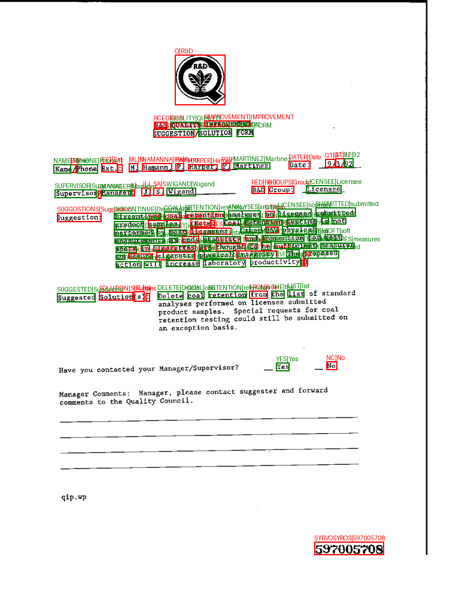 | 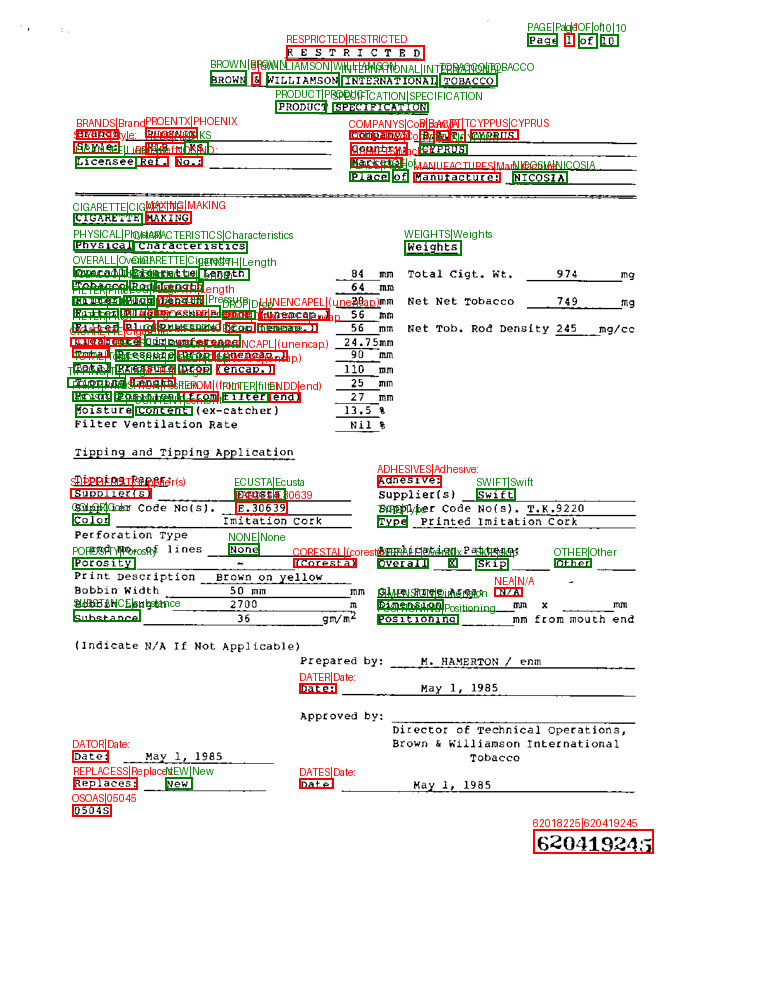 |
| 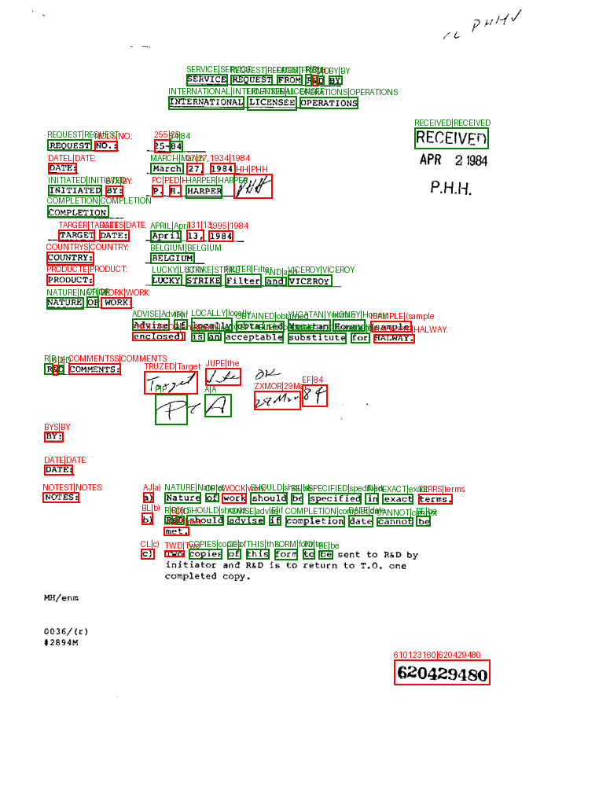 | 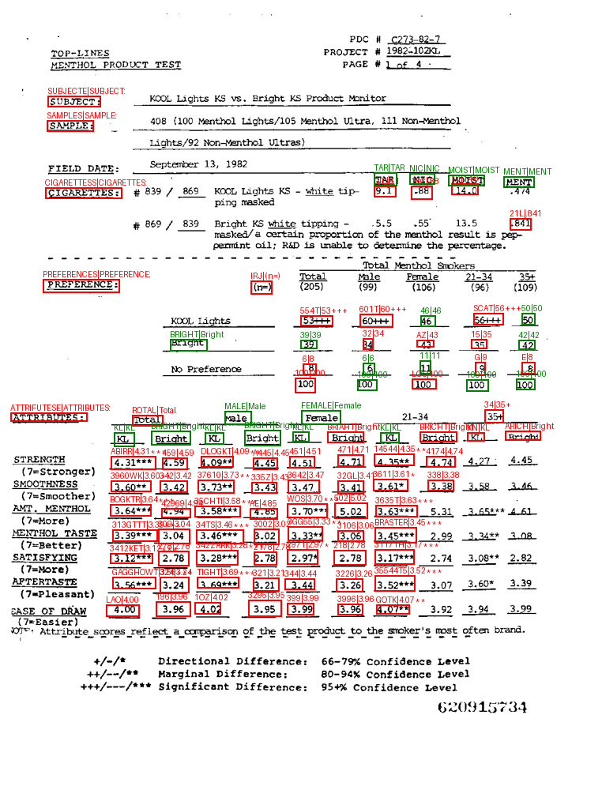 |
| 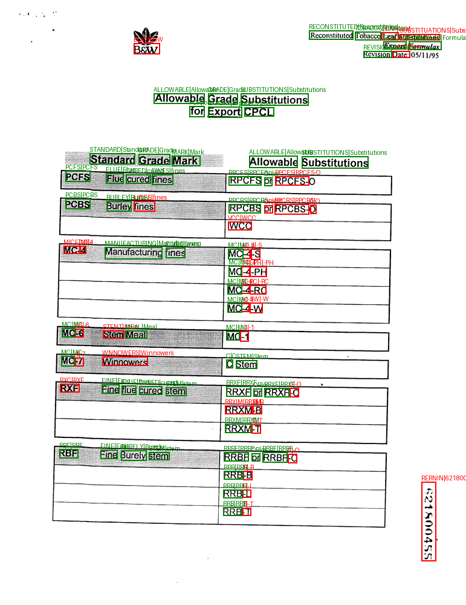 | 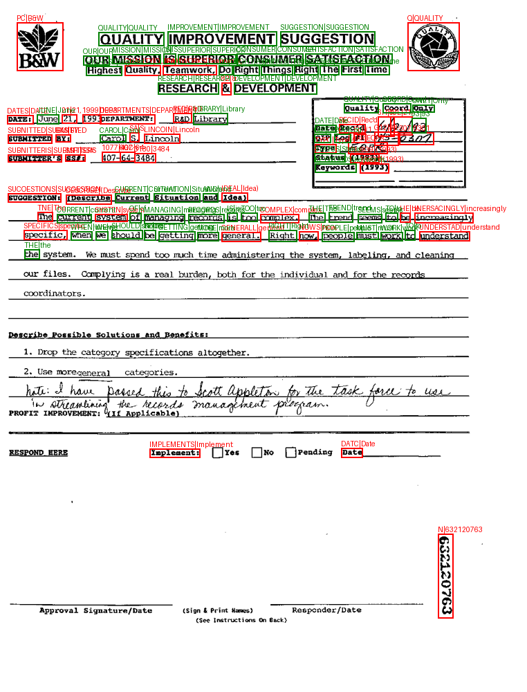 |
| 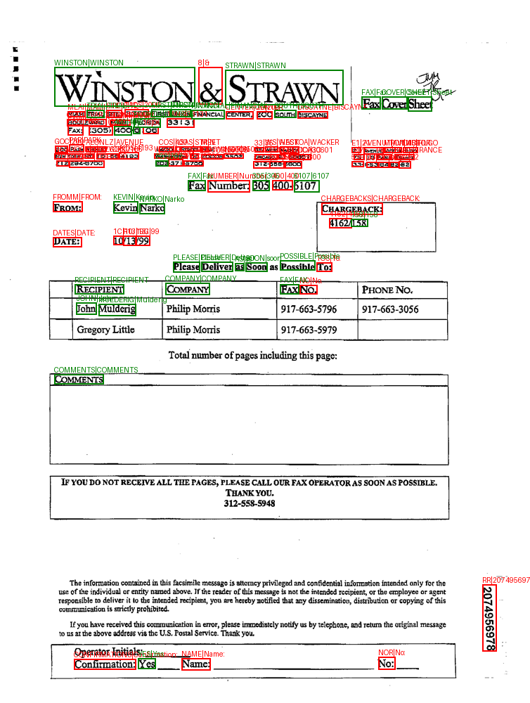 | 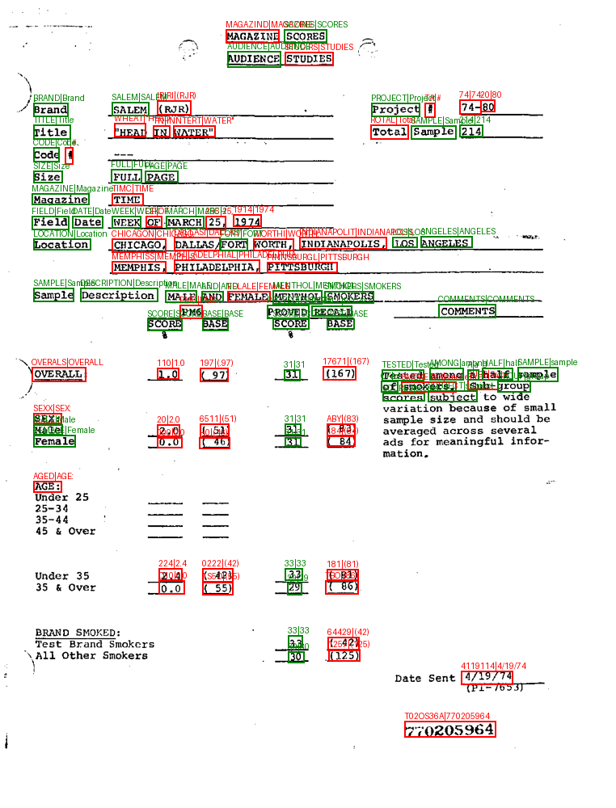 |
| 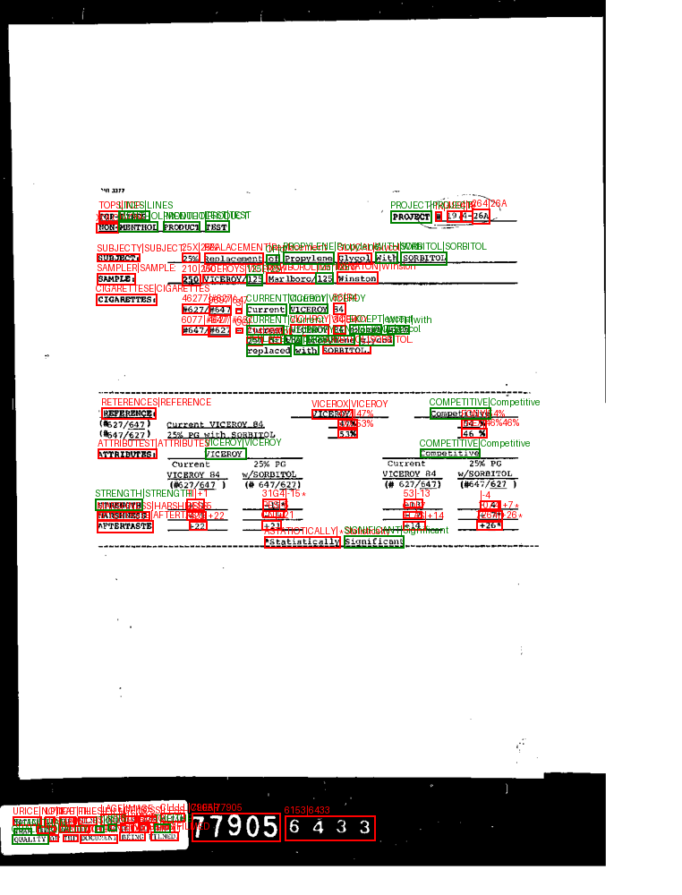 | 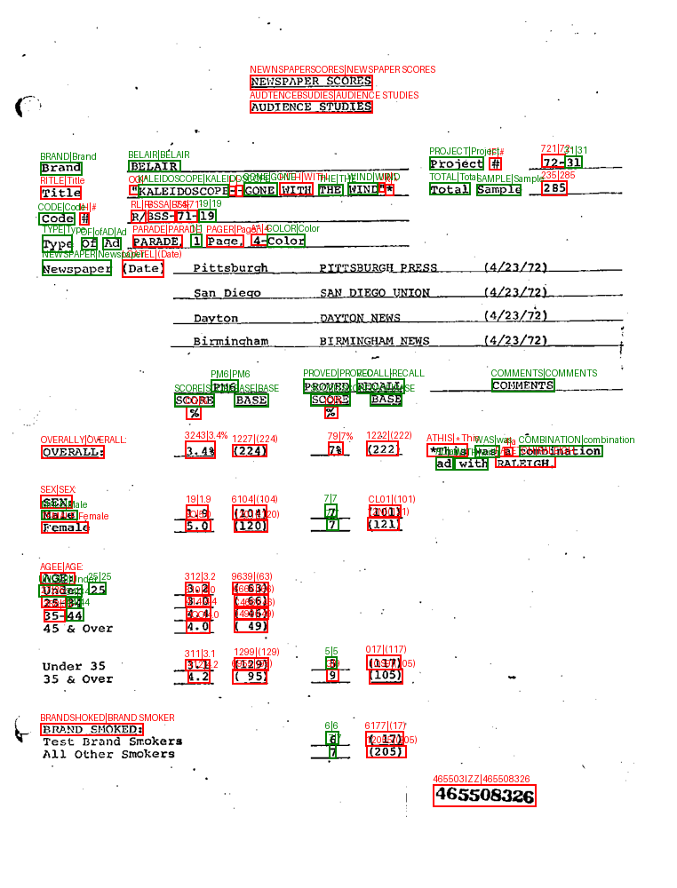 |

### 하이퍼파라미터

```python
# 데이터셋
IMG_SIZE = (100, 32)           # (width, height)
MAX_TEXT_LEN = 22              # 최대 텍스트 길이
TARGET_CHARACTERS = "ABCDEFGHIJKLMNOPQRSTUVWXYZ0123456789"

# 학습
BATCH_SIZE = 128               # 배치 크기
LEARNING_RATE = 0.1            # Adadelta 학습률
EPOCHS = 20                    # 최대 에포크
PATIENCE = 2                   # Early stopping

# 모델
NUM_CHARS = 37                 # 36 chars + 1 blank
SEQUENCE_LENGTH = 35           # 7×5 (CNN 출력)
LSTM_HIDDEN = 256              # LSTM 은닉 유닛
```
