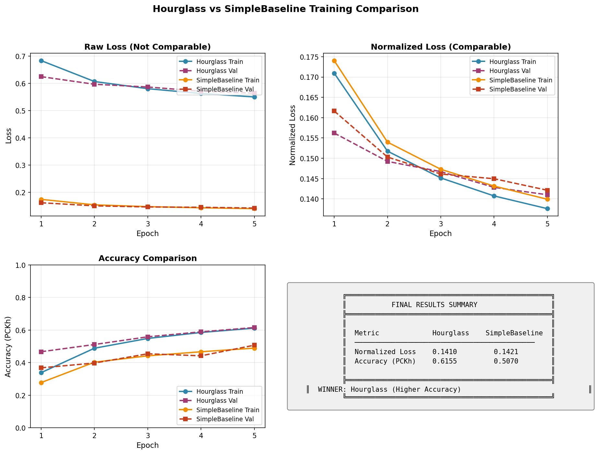
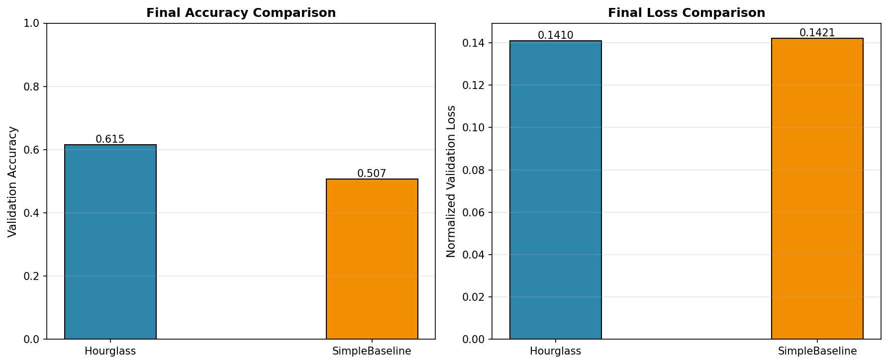
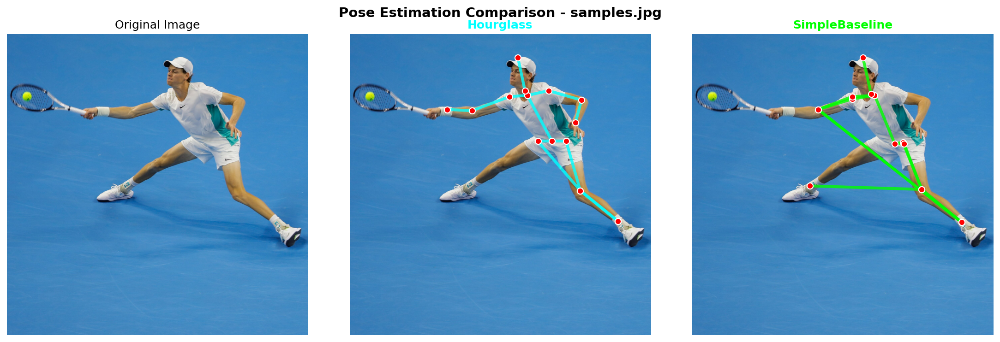
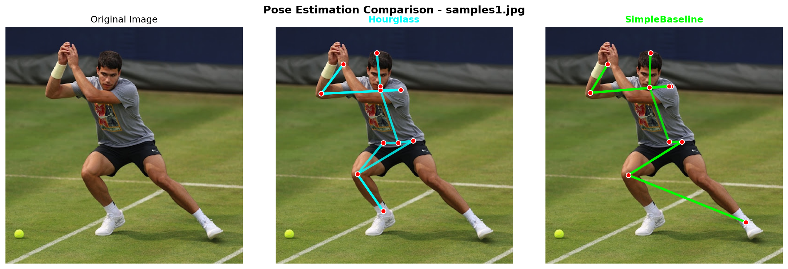

# 보고서

## 1. 프로젝트 개요

MPII Human Pose (Stacked Hourglass, SimpleBaseline) 비교 분석

---

## 2. 데이터셋 구성 및 전처리

### 2.1 데이터셋 구성

| 항목             | 값               |
| ---------------- | ---------------- |
| Train 샘플       | ~22,000개        |
| Validation 샘플  | ~2,900개         |
| 키포인트 수      | 16개 (MPII 표준) |
| 입력 이미지 크기 | 256×256          |
| Heatmap 크기     | 64×64            |

### 2.2 16개 키포인트 (MPII 정의)

```
0: R_ANKLE     4: L_KNEE      8: UPPER_NECK   12: R_SHOULDER
1: R_KNEE      5: L_ANKLE     9: HEAD_TOP     13: L_SHOULDER
2: R_HIP       6: PELVIS     10: R_WRIST      14: L_ELBOW
3: L_HIP       7: THORAX     11: R_ELBOW      15: L_WRIST
```

### 2.3 전처리 파이프라인

1. **Crop**: 사람 영역 추출 (scale 기반 margin 적용)
2. **Resize**: 256×256으로 통일
3. **Normalize**: `[-1, 1]` 범위로 정규화
4. **Heatmap 생성**: 16채널 2D Gaussian Heatmap (σ=1, scale=12)

---

## 3. 베이스라인 구축 (30분 내 1 Epoch)

### 3.1 학습 시간 실측 (RTX 5070 Ti, 16GB VRAM)

| 모델                  | 1 Epoch 시간 | 5 Epoch 총 시간 | 30분 목표 |
| --------------------- | ------------ | --------------- | --------- |
| **Stacked Hourglass** | 29.04분      | ~2.4시간        | 달성      |
| **SimpleBaseline**    | 22.42분      | ~1.9시간        | 달성      |

### 배치당 2.6초 이하면 30분 내 가능

### 3.2 학습 설정

- **Batch Size**: 32
- **Learning Rate**: 1e-3 (Adam optimizer)
- **Mixed Precision**: AMP (autocast + GradScaler) 적용
- **Loss Function**: Weighted MSE (Peak 영역 가중치 82, 배경 1)

---

## 4. 모델 아키텍처 비교

### 4.1 Stacked Hourglass Network

```
Input (256×256×3)
    ↓
Conv 7×7, stride=2 → 128×128×64
    ↓
BottleneckBlock × 3 → 64×64×256
    ↓
┌─────────────────────────────────┐
│  Hourglass Module × 4 (stacked) │
│  - Encoder-Decoder 구조          │
│  - Multi-scale feature 추출      │
│  - Intermediate Supervision      │
└─────────────────────────────────┘
    ↓
Output: 64×64×16 (4개 출력)
```

- **파라미터 수**: ~25.5M
- **특징**: 재귀적 구조, Multi-scale feature, 4개 스택

### 4.2 SimpleBaseline

```
Input (256×256×3)
    ↓
ResNet50 (pretrained) → 8×8×2048
    ↓
Conv 1×1 → 8×8×256
    ↓
Deconv 4×4 × 3 → 64×64×256
    ↓
Conv 1×1 → 64×64×16
    ↓
Output: 64×64×16 (1개 출력)
```

- **파라미터 수**: ~34.0M
- **특징**: Transfer Learning (ImageNet pretrained), 단순한 구조

---

## 5. 학습 결과 비교 (5 Epochs)

### 5.1 전체 성능

| 지표                        | Hourglass | SimpleBaseline | 차이       |
| --------------------------- | --------- | -------------- | ---------- |
| **Val Loss (정규화)**       | 0.141     | 0.142          | 거의 동일  |
| **Val Accuracy (3px)**      | 0.6155    | 0.5070         | **+21.4%** |
| **PCKh@0.5**                | 0.6963    | 0.5818         | **+19.7%** |
| **Mahalanobis Distance**    | 5.055     | 5.345          | -5.4%      |
| **Training Time(5 Epochs)** | 29.04분   | 22.42분        | +29.5%     |



**각 모델의 Train, Validation Loss 비교를 하였을 때, SimpleBaseline이 Hourglass보다 아주 근소하게 높은 성능을 보였습니다.**



**각 모델의 Train, Validation Accuracy 비교를 하였을 때, Hourglass가 SimpleBaseline보다 높은 성능을 보였습니다.**

### 5.2 Per-Joint 정확도 비교

| 관절       | Hourglass | SimpleBaseline | Winner        |
| ---------- | --------- | -------------- | ------------- |
| R_Ankle    | 0.5531    | 0.4594         | HG            |
| R_Knee     | 0.5281    | 0.3812         | HG            |
| R_Hip      | 0.4469    | 0.3344         | HG            |
| L_Hip      | 0.5000    | 0.3563         | HG            |
| L_Knee     | 0.5469    | 0.3938         | HG            |
| L_Ankle    | 0.5719    | 0.4906         | HG            |
| Pelvis     | 0.5594    | 0.5844         | **SB**        |
| Thorax     | 0.8562    | 0.8438         | HG            |
| Upper_Neck | 0.8938    | 0.8938         | Tie           |
| Head_Top   | 0.8094    | 0.7969         | HG            |
| R_Wrist    | 0.5063    | 0.3906         | HG            |
| R_Elbow    | 0.6156    | 0.4437         | HG            |
| R_Shoulder | 0.6719    | 0.5250         | HG            |
| L_Shoulder | 0.7125    | 0.4656         | **HG (+53%)** |
| L_Elbow    | 0.6344    | 0.4688         | HG            |
| L_Wrist    | 0.5031    | 0.3969         | HG            |

**결과 요약**: 16개 관절 중 **14개에서 Hourglass 우승**, 1개 SimpleBaseline 우승, 1개 동점

---

## 6. 평가 지표 설명

### 6.1 Loss Function (Weighted MSE)

```python
weights = (labels > 0).float() * 81 + 1  # Peak: 82, Background: 1
loss = ((labels - output) ** 2 * weights).mean()
```

### 6.2 Accuracy (Pixel Distance)

- GT heatmap과 예측 heatmap의 peak 좌표 간 L2 거리
- Threshold: 3 pixels (64×64 heatmap 기준)

### 6.3 PCKh@0.5 (Percentage of Correct Keypoints - Head)

- Head size (Upper_Neck ~ Head_Top 거리)의 50% 이내면 correct
- MPII 데이터셋 표준 메트릭

### 6.4 Mahalanobis Distance

- 공분산을 고려한 거리 측정
- 낮을수록 좋음

---

## 7. 정성적 비교 (시각화)

### 7.1 Pose Estimation 결과

`result.py` 실행 시 생성되는 비교 이미지:

- 왼쪽: 원본 이미지
- 중앙: Hourglass 예측 (Cyan 스켈레톤)
- 오른쪽: SimpleBaseline 예측 (Lime 스켈레톤)
  
  

- **Hourglass의 시각화된 예측은 두 사진에서는 무릎, 두번째 사진에서는 occulsion된 반대 팔 관절을 제외한 나머지 관절을 정확하게 예측했음.**

- **SimpleBaseline은 시각화된 예측은 두 사진에서는 무릎, 두번째 사진에서는 occulsion된 반대 팔 관절, 골반을 예측하지 못하였고, Joint의 연결이 자연스럽지 못함.**

### 7.2 학습 곡선

`visualize_results.py` 실행 시 생성:

- Loss 곡선 (Raw / Normalized)
- Accuracy 곡선
- 최종 결과 요약

---

## 8. 프로젝트 파일 구조

```
pose/
├── checkpoints/
│   ├── hourglass-best.pt       # Hourglass 최고 성능 모델
│   ├── hourglass-latest.pt     # Hourglass 최신 모델
│   ├── simplebaseline-best.pt  # SimpleBaseline 최고 성능 모델
│   └── simplebaseline-latest.pt
├── model.py                    # 모델 정의
├── dataset.py                  # 데이터셋 로더
├── train.py                    # Trainer 클래스
├── utils.py                    # Gaussian heatmap 생성
├── metrics.py                  # 평가 메트릭
├── run_training.py             # 학습 실행 스크립트
├── visualize_results.py        # 학습 결과 시각화
├── result.py                   # Pose 추론 시각화
└── 보고서.md                   #
```

---

## 9. 실행 명령어

```bash
# 두 모델 학습 (5 epochs)
python run_training.py --model both --epochs 5

# 학습 곡선 시각화
python visualize_results.py

# Pose Estimation 결과 시각화
python result.py

# 메트릭 상세 분석
python metrics.py
```

---

## 10. 결론

| 항목            | Hourglass    | SimpleBaseline    |
| --------------- | ------------ | ----------------- |
| **정확도**      | 우수 (+20%)  | -                 |
| **학습 속도**   | -            | 우수 (1.3배)      |
| **모델 크기**   | 25.5M (작음) | 34.0M (큼)        |
| **구현 복잡도** | 높음         | 낮음 (pretrained) |
| **30분 목표**   | 달성         | 달성              |
