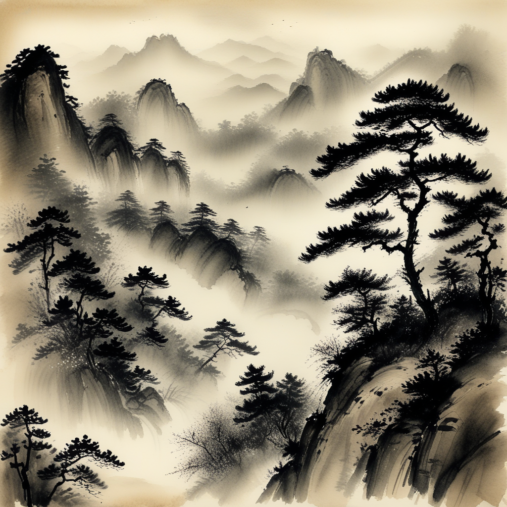
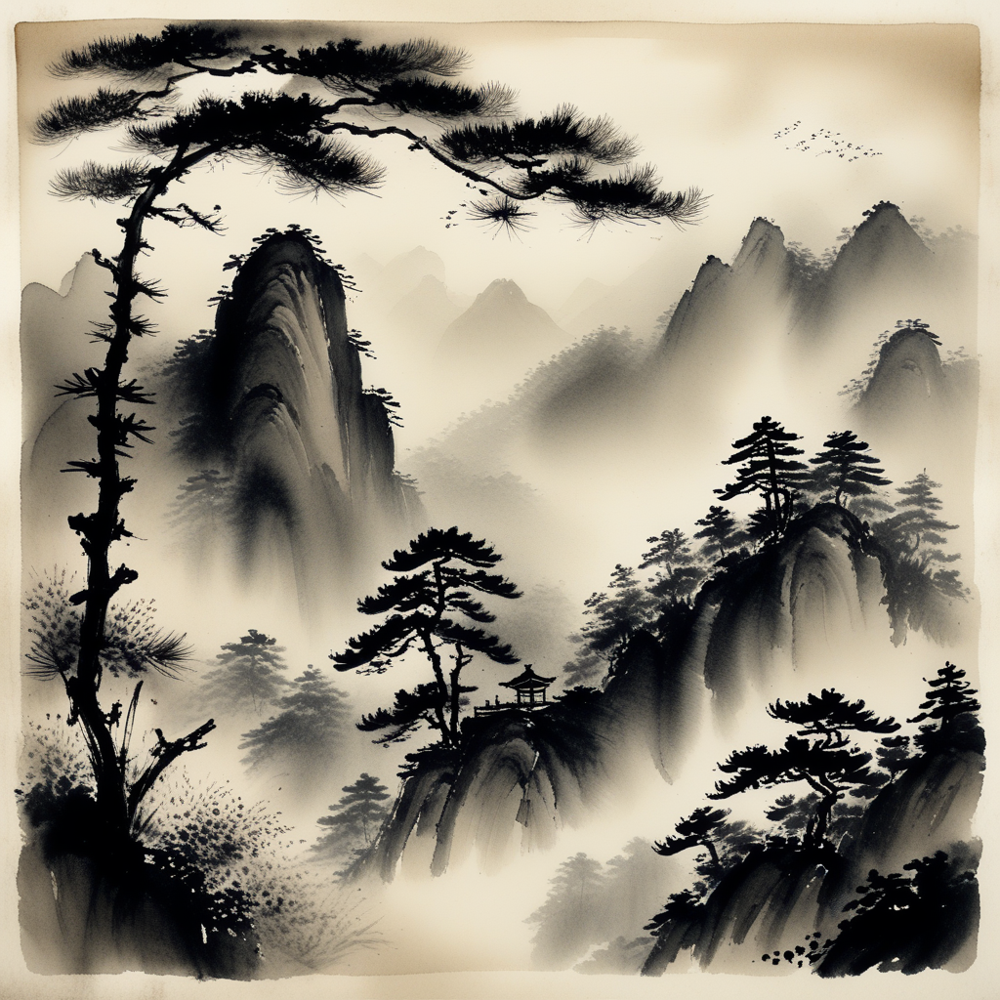
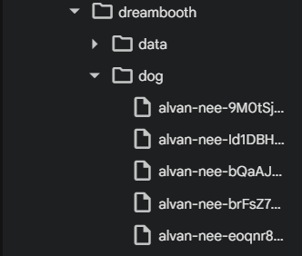
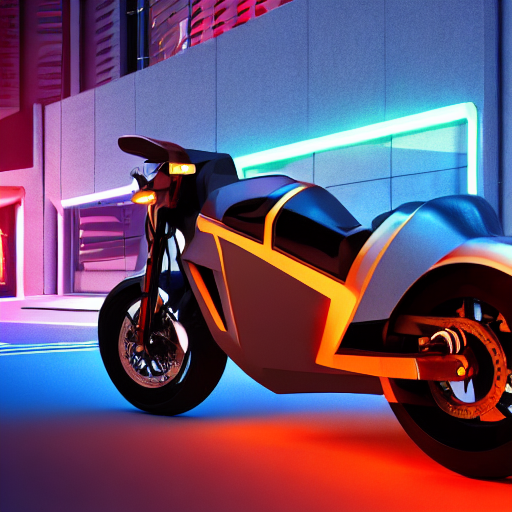
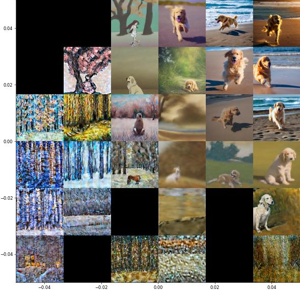
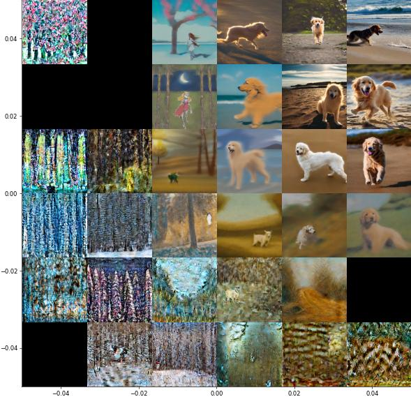

# 보고서

나만의 취향이 담긴 생성 이미지를 만들어보았는가?

웹사이트에서 원하는 Checkpoint 와 Lora 파일을 다운로드하고, 생성 모델 파이프라인을 구축하여 이미지를 생성하였다.

체크포인트

https://huggingface.co/stabilityai/stable-diffusion-xl-base-1.0

LoRA

https://civitai.com/models/646411/f2-midjourney-v61-meets-flux-illustrious-sdxl?modelVersionId=723149

프롬프트

```python
image = pipeline(
    prompt="masterpiece, high quality, traditional oriental ink painting, sumi-e style, mountains and pine trees in soft mist, ink wash, subtle ink diffusion, delicate brush strokes, minimalistic composition, empty space, serene atmosphere, rice paper texture, natural flow of ink, <lora:add_detail:0.2>",

    negative_prompt="anime, cartoon, 3d render, digital art, bright saturated colors, vivid colors, neon colors, text, logo, geometric patterns, synthetic texture, human figure, creature, fantasy elements, distorted shapes, blurry, low quality",

    num_inference_steps=28,
    guidance_scale=7,
).images[0]
```

불쾌함을 유발하지 않을 적절한 동양 수묵화 이미지를 생성 하였다.





Stable diffusion 모델의 dreambooth 미세조정을 실습하였는가?

미세조정에 사용할 대상의 모습이 담긴 Instance 와 class 이미지를 각각 마련하여 알맞은 경로에 저장하고, 데이터를 모델을 학습시켜 대상이 담긴 이미지를 생성하였다.

```python
script_content = """#!/bin/bash
export MODEL_NAME="CompVis/stable-diffusion-v1-4"
export INSTANCE_DIR="./diffusers_git/examples/dreambooth/dog_instance"   # sks 대상 5~6장
export CLASS_DIR="./diffusers_git/examples/dreambooth/dog_class"         # 일반 dog 100장+

export OUTPUT_DIR="./diffusers_git/examples/dreambooth/data"

echo $MODEL_NAME

accelerate launch ./diffusers_git/examples/dreambooth/train_dreambooth.py \\
  --pretrained_model_name_or_path=$MODEL_NAME  \\
  --instance_data_dir=$INSTANCE_DIR \\
  --class_data_dir=$CLASS_DIR \\
  --output_dir=$OUTPUT_DIR \\
  --instance_prompt="a photo of sks dog" \\
  --class_prompt="a photo of dog" \\
  --resolution=512 \\
  --train_batch_size=1 \\
  --with_prior_preservation --prior_loss_weight=1.0 \\
  --gradient_accumulation_steps=1 --gradient_checkpointing \\
  --use_8bit_adam \\
  --enable_xformers_memory_efficient_attention \\
  --set_grads_to_none \\
  --learning_rate=2e-6 \\
  --lr_scheduler="constant" \\
  --lr_warmup_steps=0 \\
  --num_class_images=100 \\
  --max_train_steps=100
"""

with open("train_dreambooth.sh", "w") as f:
    f.write(script_content)

```

Instance 와 class 이미지를 각각 마련하였고, `num_class_images=100` 각 클래스 마다 100장의 이미지를 추가 하였다.





```python
prompt = "A 3D render of a futuristic motorcycle parked in a neon-lit street, glossy reflections, cinematic look"
image = pipeline(prompt, num_inference_steps=50, guidance_scale=7.5).images[0]

image.save("bike.png")
image
```



잠재적 표현의 변화가 모델 출력에 미치는 영향을 관찰하였는가?

텍스트 프롬프트 2 개를 설정하고 LDM 에 넣어 이미지를 생성한 후, 생성 이미지 안에서 점차 변화되는 특성들에 대한 분석 결과를 기록하였다.

```python
prompt = "A 3D render of a futuristic motorcycle parked in a neon-lit street, glossy reflections, cinematic look "
image = pipe(prompt).images[0]

# 생성된 이미지를 출력합니다.
plt.imshow(np.array(image))
plt.axis("off")
plt.show()
```


```python
prompt_1 = "A 3D render of a futuristic motorcycle parked in a neon-lit street, glossy reflections, cinematic look"
prompt_2 = "A still life DSLR photo of a bowl of fruit"
interpolation_steps = 30
```

bike_and_fruit.gif

```python
prompt_1 = "An anime-style illustration of a girl standing under cherry blossoms, vibrant colors, soft shading"
prompt_2 = "A high-quality DSLR photo of a Golden Retriever running on a sunny beach, sharp focus, natural lightingt"
prompt_3 = "A small wooden cabin in the mountains during heavy snowfall, soft diffused lighting, winter ambiencet"
prompt_4 = "An oil painting of a Golden Retriever sitting in a garden, detailed brush strokes, rich texture"

# 보간 관련 설정
interpolation_steps = 6
batch_size = 3
# 총 생성할 임베딩 수: 6 * 6 = 36, 배치 수 = 36 // 3 = 12
batches = (interpolation_steps**2) // batch_size
```





2장의 사진 각 네 모서리에 각각 다른 프롬프트를 작성하였다.

2장의 사진은 모두 같은 프롬프트에서 출력된 사진들이다.

프롬프트는 다음과 같다.

```python
prompt_1 = "An anime-style illustration of a girl standing under cherry blossoms, vibrant colors, soft shading"
prompt_2 = "A high-quality DSLR photo of a Golden Retriever running on a sunny beach, sharp focus, natural lightingt"
prompt_3 = "A small wooden cabin in the mountains during heavy snowfall, soft diffused lighting, winter ambiencet"
prompt_4 = "An oil painting of a Golden Retriever sitting in a garden, detailed brush strokes, rich texture"
```

LDM 에 넣어 이미지를 생성한 후, 생성 이미지 안에서 점차 변화되는 특성들에 대한 분석 결과를 기록하였다.

왼쪽 상단 : 애니메이션 스타일의 여자가 벚꽃 나무 밑에 서 있는

오른쪽 상단 : 골든 리트리버가 해변을 달리는 모습을 dslr 카메라로 찍은

왼쪽 하단 : 눈 내리는 산에 나무 오두막

오른쪽 하단 : 유화로 그린 골든 리트리버가 정원에 앉아 있는

오른쪽 하단, 오른쪽 상단은 프롬프트대로 나오지 않았지만, 가운데의 4가지 사진은 4가지 프롬프트가 적절히 섞여 생성되었다.
